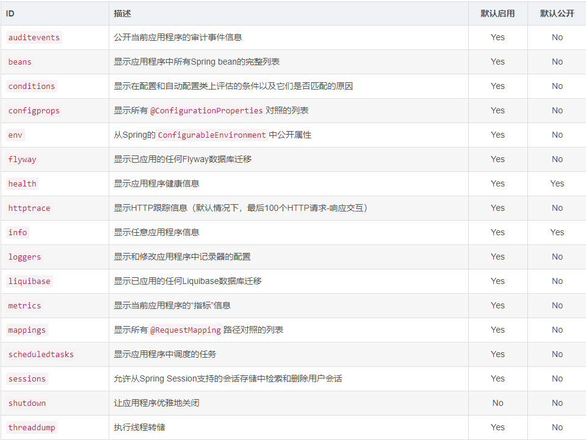
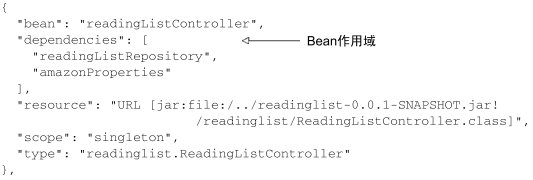
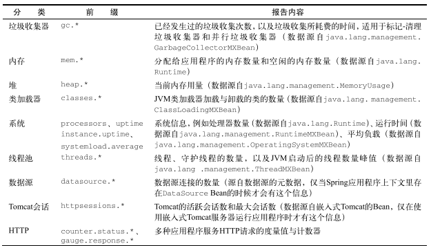
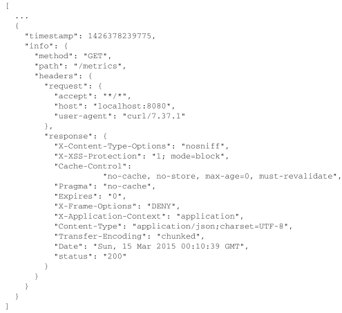
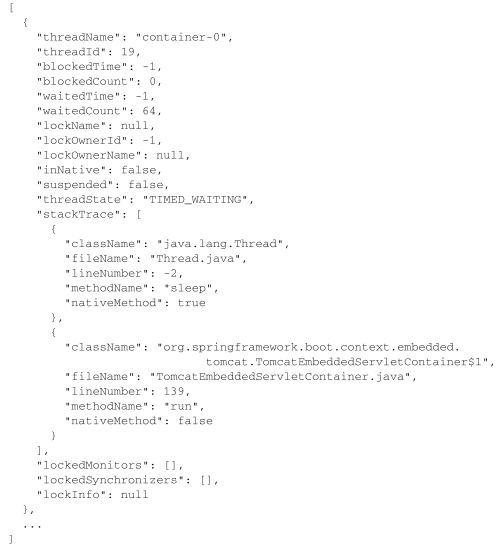

# Spring Boot in Action

[toc]


## 一、入门

### Sping Boot的核心

* 自动配置

* 起步依赖

  *其实就是特殊的Maven依赖和Gradle依赖，利用了传递依赖解析，把常用库聚合在一起，组成了几个为特殊功能而定制的依赖。*

  例如 spring-boot-starter-web

* 命令行界面（可选）

* Actuator

  *提供运行时检视应用程序内部的能力，包含如下细节*

  * Spring应用程序上下文里配置的Bean
  * Spring Boot的自动配置做的决策
  * app收到的环境变量、系统属性、配置属性和命令行参数
  * app里线程当前的状态
  * 最近处理过的HTTP请求的追踪情况
  * 各种和内存用量、垃圾回收、Web请求以及数据源用量相关的指标  

  **Spring Boot就是Spring**

##  二、Spring Boot开发第一个程序

1.在IDEA中使用Spring Initializr可以得到建立好的Maven/Gradle项目结构

2.XXXApplication是应用程序的启动引导类，也是主要的Spring配置类，初始只有一行配置代码@SpringBootApplication实际上是三个注解的组合

* @Configuration:表明该类使用Spring基于Java的配置
* @ComponentScan:启动组建扫描(所以使用@Component(或@Service,@Controller,@Repository)注解的组件才能被自动发现并且注册为Spring应用程序上下文里的Bean)
* Spring Boot的@EnableAutoConfiguration：开启Spring Boot自动配置

3.使用application.properties可以帮助细粒度的调整自动配置，例如server.port = xxxx改变默认的8080


### 起步依赖

* 起步依赖有很多，并不需要制定版本号,版本由使用的SB版本确定，起步依赖优惠决定它们引入的传递依赖的版本。

  **覆盖**

  * 不需要，可以在maven中用<exclusions>来排除依赖

  * 需要使用另外一个版本，直接在pom.xml中表达诉求

### 自动配置

* 是一个程序启动时的过程，考虑众多因素才觉得配置应该用哪个，不该用哪个，例如会考虑Spring Security是不是在Classpath里，是的话就进行一个非常基本的Web安全配置。

* 会做接近200个这样的决定，涵盖安全、集成、持久化、Web开发等诸多方面。

  **如何实现**

  在向应用程序加入Spring Boot时，有个名为spring-boot-autoconfigure的JAR文件，其中包含了很多配置类，每个配置类都在应用程序的Classpath里，都有机会为应用程序的配置添砖加瓦。*利用了Spring4.0的条件化配置，条件化配置允许配置存在于应用程序中，但是在满足某些特定条件之前都忽略这些配置。*

  ​        **更具体的** 

  ​        实现Condition接口然后重写matches()方法，然后在声明Bean的时候，可以使用这个自定义条件类，如果不满足这个条件的话Bean的声明就会被忽略掉。


## 三、自定义配置

*  覆盖自动配置

  覆盖自动配置很简单，就当自动配置不存在，直接显式地写一段配置。

  **实现**

  扩展配置类并且覆盖里边的方法，自动配置类上的条件化配置会检测到已经有了配置的Bean,就会直接跳过

* 通过属性文件外置配置

  SB自动配置的Bean提供了300多个用于微调的属性，只需要调整设置，获取配置的优先级从高到低为

  * 命令行参数
  * java:comp/env里的JNDI属性
  * JVM系统属性
  * 环境变量
  * 随机生成的带random.*前缀的属性
  * 应用程序以外的application.properties
  * 打包在程序内的appliction.properties
  * 通过@PropertySource标注的属性源
  * 默认属性

  *允许使用Profile配置不同的运行环境*

* 可以定制应用程序错误界面让它更加有艺术性


## 四、测试

*编写单元测试的时候Spring不需要介入，Spring鼓励松耦合、接口驱动的设计，这些都会帮助编写单元测试，但是在写单元测试时不需要用到Spring。*

*但是集成测试要用到Spring,如何生产程序使用Soring来配置并且组装组件，那么测试就需要用它来哦欸中并组装那些组件*

#### 集成测试自动配置

#### 注解

* ```@SpringRunner ```可以在基于JUnit的应用程序测试里加载Spring应用程序上下文
* ```@Runwith(SpringRunner.class)```代表让测试运行于Spring测试环境
* @ContextConfiguration制定了如何加载应用程序上下文（但是不能加载SB，推荐使用@SpringApplicationConfiguration） **经测试不需要**
* ```@SpringBootTest```加在测试类上，``@Test``加在方法上，不需要mian和启动就可以测试，``@Before``代表在测试之前做的事情


#### 测试Web应用程序

要恰当地测试一个Web应用程序，你需要投入一些实际地HTTP请求，确认它能正确地处理那些请求，SB有两个可选的方案

* Spring Mock MVC:在近似真实的模拟servlet容器里测试控制器，而不用实际启动应用服务器
* Web集成测试，在嵌入式Servlet容器（比如Tomcat或Jetty）里启动应用程序，在真正的应用服务器里执行测试

##### 模拟Spring MVC

可以使用``MockMvcBuilders``，该类提供了两个静态方法

* ``standaloneSetup``：构建一个Mock MVC，提供一个或多个收购创建并配置的控制器
* ``webAppContextSetup``:使用Spring应用程序上下文来创建

##### 示例

```
@RunWith(SpringRunner.class)
@SpringBootTest
@AutoConfigureMockMvc
public class SuperadminApplicationTests {

    @Autowired
    private MockMvc mockMvc;
   
    @Test
    public void getTotal() throws Exception{
        mockMvc.perform(MockMvcRequestBuilders.get("/admin/getTotal"))
                .andExpect(MockMvcResultMatchers.status().isOk())
                .andExpect(MockMvcResultMatchers.jsonPath("status").value("20000"))
                .andDo(MockMvcResultHandlers.print())
                .andReturn();
    }
}
```


  `.perform()` 执行一个MockMvcRequestBuilders请求。其中`.get()`表示发送get请求（可以使用get、post、put、delete等）；`.contentType()`设置编码格式；`.param()`请求参数,可以带多个。`andExpect()`添加MockMvcResultMatchers验证规则，验证执行结果是否正确。`status().isOk()`校验返回200，`jsonPath`可以对返回的JSON字段进行校验。`.andDo()`添加 MockMvcResultHandlers结果处理器,这是可以用于打印结果输出。`.andReturn()`结果还回，然后可以进行下一步的处理。


##### 测试Web安全

使用Spring Security后要进行测试，要添加测试模块。

经过身份验证的请求的发起

* `@WithMockUser` 加载安全上下文，其中包含一个UserDetails对象，使用了给定的用户名、密码和授权
* `@WithUserDetails`根据给定的用户名查找UserDetails对象，加载安全上下文


##### 测试实际运行的应用程序

`@WebIntegerationTest`声明启动嵌入式的Servlet容器，然后使用`RestTemplate`发起请求


## 五、Actuator

#### 端点

关键特性是在应用程序里提供众多的Web端点，通过他们能了解应用程序运行时的内部状况，要使用引入起步依赖spring-boot-starter-actuator



这些端点分为三大类，**配置端点**，**度量端点**，**其它端点**

##### 配置

* /bean装配报告

  

  Bean条目有五类信息

  * bean:Spring应用程序上下文中的名称或ID
  * resource:.class文件的物理位置，通常是一个URL，指向构建出的JAR。这会随着应用程序的构建和运行方式发生变化。

  * denpendencies:当前Bean注入的Bean ID列表
  * scope:Bean的作用域（通常是单例，也是默认作用域）
  * type:Bean的Java类型

* /autoconfig端点告诉你为什么会有这个Bean,或者为什么没有这个Bean

* /env会生成应用程序可用的**所有**环境属性的列表，无论这些属性是否用得到。

* /mappings端点提供了控制器的映射


##### 度量

* 查看度量值 /metrics 是运行时度量状况的一个快照，对于评估应用程序的健康状况很有帮助。

  

* 追踪Web请求 /trace端点能够报告所有Web请求的详细信息，包括请求方法、路径、时间戳以及请求和响应的头信息



* 导出线程活动 /dump

#### 

* 健康情况（是否在运行） /health

##### 其它

* /shutdown,关闭程序，默认关闭
* /info，展示希望发布的应用信息

#### 通过shell连接

#### 通过JMX监控

#### 定制Actuator

#### 保护Actuator

