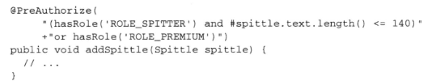
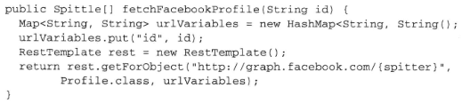

# Spring in Action

[toc]


## Spring的核心

**依赖注入DI** 和**面向切面编程AOP**

### 1.Spring之旅

* 简化JAVA开发

  为了降低JAVA开发的复杂性，Spring采取了以下4中关键策略

  * 基于POJO的轻量级和最小侵入性编程

    不会强迫实现Spring规范的接口或集成Spring规范的类。相反，再基于Spring构建的应用中，它的类通常没有任何痕迹表明你使用了Spring。最坏的场景是，一个类或许会使用Spring注解，但它依旧是POJO

  * 通过DI和AOP实现松耦合

    **依赖注入**

    * 实现

    传统的做法是每个对象负责管理与自己相互协作的对象（即它所依赖的对象）的引用，这将会导致高度耦合和难以测试的代码。但是，完全没有耦合的代码什么都做不了。**所以，耦合是必须的，但应当被小心谨慎地管理。**

    通过DI，对象的依赖关系将由系统中负责协调各对象的第三方组件在创建对象的时候进行设定。对象无需自行创建或管理它们的依赖关系。

    

    一种实现是构造器注入，就是在初始化的时候将所依赖的类的对象作为构造器参数传入。这样就实现了松耦合，一个对象只通过接口（而不是具体实现或初始化过程）来表明依赖关系，那么这种依赖就能够在对象本身毫不知情的情况下，用不同的具体实现进行替换（所以方便测试，可以mock一个对象传入构造器）。

    * 装配

    创建应用组件之间写的的行为通常称为装配（wiring），可以通过XML或Java来进行配置。

    * 如何工作

    Spring通过**应用上下文**（Application Context）装载bean的定义并把它们组装起来。Spring应用上下文全权负责对象的创建和组装，Spring自带了多种应用上下文的实现，区别仅仅是如何加载配置（xml、java...）

  * 基于切面和惯例进行声明式编程

    允许把遍布应用各处的功能分离出来形成可重用的组件。例如日志、事务管理和安全这样的系统服务经常融入到自身具有核心乐舞逻辑的组件中去，这些系统服务通常被称为横切关注点，因为它们会跨越系统的多个组件。

    借助AOP能够使这些服务模块化，并以声明的方式将它们应用到他们需要影响的组件中去。可以把切面想象为覆盖在很多组件之上的一个外壳。即以各种功能曾去包裹核心业务员层。

  * 通过切面和模板减少样板式代码

    Spring通过模板封装来消除样板式代码，例如JdbcTemplate使得执行数据库操作时，避免传统的Jdbc样板代码成为了可能。

    

* Bean容器

  在基于Spring的应用中，你的应用对象存在于Srping容器中，Spring容器负责创建对象，装配它们，配置它们并管理它们的整个生命周期。

  Spring的容器可以归为两种不同的类型。bean工厂是最简单的容器，提供基本的DI支持。应用上下文基于bean工厂构建，并提供应用框架级别的服务，例如从属性文件解析文本信息以及发布应用事件给感兴趣的事件监听者。

  * 使用应用上下文
  * bean的生命周期

  


## 2.装配Bean

 Spring装配Bean的基础知识

* 配置的可选方案

  Spring容器服务创建应用程序中的bean并通过DI来协调这些对象之间的关系。开发人员需要告诉Spring需要创建哪些bean并且如何将其装配在一起，Spring提供了三种主要的装配机制。

  * XML
  * Java
  * 隐式的bean发现机制和自动装配

  推荐尽可能地使用自动配置地机制，然后是使用JavaConfig

* 自动化装配

  从两个角度来实现：

  * 组件扫描（component scanning):Spring会自动发现应用上下文中所创建地bean
  * 自动装配(autowiring) :Spring自动满足bean之间的依赖

  **how to use**

  在实现类上增加`@Component`（或者Java的`@Name`）,在配置类上添加`@ComponenetScan`，所以Spring会扫描配置类所在报上所有带有`@Component`注解的类并创建bean。

  **命名**

  默认是类名的第一个字母小写，`@Component(*beanId*)`可以命名·

  **设置组件扫描的基础包**

  * `@ComponentScan(basePackages={"packageName1","packageName2"})`可以设置要扫描的基础包

  * `ComponentScan(basePackageClasses={xxx.class,xx.class)`会使Spring扫描包含这些类的包

  **@Autowired自动装配**（或者JAVA的`@Inject`）

  可以加在构造器上，也可以用在属性的setter方法等方法上。Spring会尝试满足方法参数上所声明的依赖，**如果有且只有一个bean匹配满足依赖需求的话，那么这个bean将会被装配进来**，相反的话会抛出异常。

* 通过代码装配bean

  有些情况下没有办法使用自动化配置，例如:想把第三方组件中装配到你的应用中时，是没有办法再它的类上添加`@Component`和`@Autowired`注解，所以不能自动化装配。

  * 1.创建配置类`@Configuration`

  * 2.声明bean

    需要编写一个方法，这个方法会创建所需类型的实例，然后给这个方法添加`@Bean`（表明会创建一个bean的实例并将其注册到Spring应用上下文中）

  * 3.借助JavaConfig实现注入

    同样采用2的方式创建一个bean，在构造器或者setter方法中调用想要装配的bean方法（尽管看似是使用了方法得到了所想要的实例，但是因为方法上添加了`Bean`注解，Spring将会拦截对它的调用，并确保直接返回该方法所创建的bean，而不是每次都对其进行实际的调用）。

    **Note**

    带有`@Bean`注解的方法可以采用任何必要的Java功能来产生Bean实例。

  


## 3.高级装配

* 环境与profile

* 条件化的bean

  希望一个或多个bean只有在应用的类路径下包含特定的库时才创建，或者希望某个bean只有当另外某个特定的bean也声明了之后才会创建，或者要求某个特定的环境变量设置之后才会创建可以使用`@Conditional`注解加在带有`@Bean`注解得到方法上。

* 处理autowired的歧义性

  如果一个接口有多个实现的话，Spring无法正确的进行自动装配，为此提供了多种解决方案

  * 标示首选的bean

    将·`@Primary`与`@Component`或者`@Bean`合用标志是首选，同样的，如果扫描到多个bean都有`@Primary`,Spring也无法进行自动装配

  * 限定自动装配的bean

    `@Qualifier(beanId)`直接指定注入进去的是哪个bean，**这里的问题是所指定注入的bean的名称与所指定的限定符是紧耦合的，对类名称的任意改动会导致限定符失效。*

    * 创建自定义的限定符

    ​        即使用`@Qualifier("xxxx")`与`@Component`或`@Bean`组合使用标注这个bean的限定符是什么

    * 创建自定义的限定符**注解**

      第一种方式中还可能出现问题，那就是qulifier中的限定符属性仍可能出现重复，而且不能添加新的`@Qualifier`

      所以可以创建自定义的限定符注解，**它本身使用@Qualifier注解来标注**，所以可以使用多个这样的自定义注解和`@Component`组合使用表明bean的属性，同样的，在注入点，使用必要的限定符注解进行任意组而将可选范围缩小到只有一个bean满足需求。

* bean的作用域

  默认情况下，Sring应上下文中的所有bean都是作为以单例（singleton）的形式创建的，不管给定的一个bean被注入到其他bean多少次，每次所注入的都是同一个实例。

  在大多数情况下，单例bean是很很理想的方案，所以初始化和垃圾回收对象实例所带来的成本只留给一些小规模任务，在这些任务中，让对象保持无状态并且在应用中反复重用这些对象可能并不合理。

  所以Spring定义了多种作用域，可以基于这些作用域来创建bean

  * 单例
  * 原型（Prototype）：每次注入或者通过Spring应用上下文获取的时候都会创建一个新的bean实例
  * 会话（Session）：在Web应用中，为每个会话创建一个bean实例
  * 请求（Rquest）：在Web应用中，为每个请求创建一个bean实例

  如果不想使用默认的作用域，可以使用`@Scope`注解与`@Component`和`@Bean`组合使用，例如`@Scope(ConfigurableBeanFactory.SCOPE_PROTOTYPE)`

  **使用会话和请求作用域**

  例如，对于购物车bean来说，会话作用域是最为合适的，因为它与给定的用户关联性最大。会为没一个会话创建一ShoppingCart，但是在当前会话相关的操作中，bean相当于是单例的。

  ```java
  @Component
  @Scope(value = WebApplicationContext.SCOPE_SESSION,
          proxyMode = ScopedProxyMode.INTERFACES)
  public ShooppingCart cart() {...} 
  ```

  会有问题:

  可能需要把这个bean注入到单例模式的bean中，而单例模式的bean会在context加载时创建，当他创建时，Spring会试图将ShoppingCart bean注入。但是ShoppingCart bean是会话作用域的，此时不存在，直到有某个用户进入系统创建会话之后才会有实例，另外系统中会有多个ShoppingCart bean实例，不想让单例的bean被注入某个特定的ShoppingCart bean实例。

  解决方案：

  会注入一个ShoppingCart bean的代理，这个代理会暴露ShoppingCart相同的方法，当要调用ShoppingCart的方法时，代理会对其进行懒解析并将调用委托给会话作用域内真正的ShoppingCart bean。`proxyMode = ScopedProxyMode.INTERFACES`代表这个代理要实现ShoppingCart接口，但是如果ShoppingCart是一个具体的类的话，要使用`proxyMode = ScopedProxyMode.TARGET_CLASS`表明以生成目标类扩展的方式创建代理。

  


* 运行时值注入

  bean装配的一个方面值得是将一个值注入bean的属性或者构造器参数。将值直接硬编码在配置类中是可以实现需求的，但是有的时候希望让这些值在运行时再确定。

  提供了两种方法  属性占位符（Property placeholder）和Spring表达式语言（SpEL）
  
  * 注入外部的值
  
    **使用Enviroment**
  
    使用方法，`@PropertySource("classpath:/xxx/xx/xx/xx.properties")`声明属性源，注入到`Enviroment`中，然后就可以从类的实例中检索属性`env.getProperty("xxx.xx")`。
  
    getProperty()有四个重载的方式:
  
    
  
    后两种可以将默认的String返回类型进行更改
  
    **使用属性占位符**
  
    占位符的形式为使用“${...}”包装的属性名称，如果依赖于组件扫描和自动装配来初始化应用组件的话，那么就没有指定占位符的配置文件和类了，在这种情况下，可以使用`@Value`注解
  
    
  
    *为了使用占位符，需要配置一个`PropertySourcePlaceholderConfigurer`的bean，它能够基于Spring Environment以及属性源来解释占位符*   **Spring Boot中是默认含有的**
  
  * 使用SpEL
  
    SpEL的特性:
  
    * 使用bean的ID来引用
    * 调用方法和访问对象的属性
    * 对值进行算术、关系和逻辑运算
    * 正则表达式匹配
    * 集合操作


## 4.面向切面的Spring

日志、声明式事务、安全和缓存等功能需要用到应用程序的多个地方，被称为横切关注点，这些横切关注点从概念上是与应用的业务逻辑相分离的，AOP正是来解决这个问题。

* 什么是AOP

  

  切面提供了取代继承和委托的另一种可选方案，仍然再一个地方定义通用功能，但是可以通过声明的方式定义这个功能要以何种方式在何处应用，而无需修改受影响的类。横切关注点可以被模块化为特殊的类，这些类被称为切面。

  **AOP的术语**

  

  * 通知（Advice）

    Advice定义了切面是什么以及何时使用。Spring切面可以应用物质类型的通知

    * 前置通知（Before）：在目标方法被调用之前调用
    * 后置通知（After）：在目标方法完成之后调用通知，不会关心输出是什么
    * 返回通知（After-returning）：在目标方法成果执行之后调用通知
    * 异常通知（Afrer-throwing）：在目标方法发抛出异常后调用通知
    * 环绕通知（Around）：通知包裹了被通知的方法，在被通知的方法调用之前和调用之后执行自定义的行为

  * 连接点（Join point）

    应用等待通知的时机。

  * 切点（Pointcut）

    切点的定义会匹配所要织入的一个或多个连接点，切点有助于缩小切面所通知的连接点的范围。

    通常会使用明确的类和方法名称，或是利用正则表达式定义所匹配的类和方法名称来指定这些切点，有些AOP框架运行我们创建动态的切点，可以根据运行时的决策（比如方法的参数值）来决定是否应用通知。

  * 切面（Aspect）

    切面就是切点和通知的集合。它是什么，在何时和何处完成其功能。

  * 引入（Introduction）  **？？？**

    允许我们向现有的类添加新方法或属性。从而可以在无需修改这些现有的类的情况下，让它们具有新的行为和状态。

  * 织入（Weaving）

    织入时把切面应用到目标对象并创建新的代理对象的过程。切面在指定的连接点被织入到目标对象中。在目标对象的生命周期里有多个点可以进行织入:

    * 编译期，需要特许的编译器，AspectJ的织入编译器
    * 类加载期，在目标类加载到JVM时被织入，这种方式需要特殊的类加载器（ClassLoader），它可以在目标类被引入应用之前增强该目标类的字节码。
    * 运行期，在应用允许的某个时刻被织入。一般情况下，AOP容器会为目标对象动态地创建一个代理对象。**Spring AOP就是使用了这种方式**。

* Spring对AOP的支持

  目前支持四种的AOP：

  * 基于代理的经典Spring AOP

  ​       过于笨重

  * 纯POJO切面

  ​        使用XML

  * **`@AspectJ`注解驱动的切面**

    本质仍是1，好处是不用使用xml

  * 注入式AspectJ切面

     需求较复杂时使用，需要使用特有的AOP语言和AOP工具集

  **Spring自己的AOP**

  也即前三种，使用Java编写。

  在运行时通知对象，通过在代理类种包裹切面，Spring在运行期把切面织入到Spring管理的bean中。代理类封装了目标类，并拦截被通知方法的调用，再调用转发给真正的目标bean。当代理拦截到方法调用时，在调用目标bean方法之前，会执行切面逻辑。

  **自己的理解**

  实际就是声明了一些功能和这些功能要在哪些方法上起作用，然后spring会根据所配置的要切入的方法在这些方法的实际所有bean外创建一个代理类，这个代理类会拦截所有对目标bean的调用并执行自己的逻辑，但是仍要转发给目标bean，最后的执行结果也要传递给调用者。

  

  **只支持方法级别的连接点**

* 通过切点来选择连接点

  Spring借助AspectJ的切点表达式语言来定义Spring切面

  

  实际只有execution指示器是实际执行匹配的，其他的都是用来限制匹配。

  **编写切点**

  

  假设需要配置切点仅匹配concert包，可以使用within()指示器来限制匹配

  

  可以在切点中引入bean()指示器，允许我们在切点表达式中使用bean的ID或名称来标识bean。

  


* 使用注解创建切面

  AspectJ所引入的关键特性。

  **切面的定义**

  


​			以上的四个注解都是使用了一个切点表达式作为它的值，所以向只定义这个切点一次，然后每次 			需要的时候引用它。`@Pointcut`能够定义一个在`@Aspect`切面内定义可重用的切点。


​		**Note**

​		尽管添加了`@AspectJ`，但此时它并不会被视为切面，需要在配置类的类级别上使用					  		`@EnableAspetctJAutoProxy`注解启动自动代理。**这个自动代理会为使用`@Aspect`注解的bean**

 	   **创建代理，这个代理会围绕所有该切面的切点所匹配的bean。**所以本质上仍是Spring基于代理的		切面。

* 创建环绕通知

  

  新的方法接受`ProceedingJoinPoit`作为参数，这个对象是必须要有的，因为你要在通知中通过它来调用被通知的方法，即`jp.proceed()`。如果不使用这个方法，通知实际上会阻塞对被通知方法的调用。也可以对proceed多次调用，*重试逻辑就是这样实现，当被通知方法失败后进行重复产尝试*

* 处理通知中的参数

  前面写的切面都是没有参数的，切面也可以访问和使用传递给被通知方法的参数

  

  在这个例子里切点声明了要提供给通知方法的参数，

  

  `args`限定符表明传递给`playTrack()`方法的int类型参数也会传递到通知中去，参数的名称`trackNumber`也与切点方法签名中的参数相匹配。

* 通过注解引入新功能

  Java不是动态语言，一旦类编译完成了，我们就很难再为该类添加新的功能了，但是实际上切面就是为对象拥有的方法添加了新功能，利用被称为**引入**的AOP概念，切面可以为Spring bean添加新方法。

  在之前的Spring AOP代理的解释中，它创建的代理类对外表现为和被通知的bean一样的接口， 那么也可以暴露新接口，当这个接口被调用的时候转发给实际实现了这个接口的某个其它对象。

  

  示例如下:

  * 声明一个新接口

  

  * 给出具体的实现

  * 声明切面，通过`@DeclareParents`注解将新接口引入到被通知的bean中

    

    * value指定了哪种类型的bean要引入该接口，'+'代表是所有的子类型
    * defaultImpl属性指定了为引入功能提供实现的类
    * `@DeclareParents`注解所标注的静态属性表明了所引入的接口

* 注入AspectJ切面

  AspectJ提供了Spring AOP所不能支持的许多类型的切点。例如，当我们需要在创建对象时应用通知，构造器切点就非常方便。

  **pass**


## 5.构建Spring Web应用程序

Spring MVC能够编著构建像Spring框架那样灵活和松耦合的Web应用程序

### Spring MVC起步

* 请求过程

  

  在请求离开浏览器时，会带有用户所请求内容的信息。

  第一站是`DispatcherServlet`，与大多数基于JAVA的Web框架一样，Spring MVC所有的请求都会通过一个前端控制器(front controller)Servlet。前端控制器是常用的Web应用程序控制模式，在这里一个单实例的Servlet将请求委托给应用程序的其它组件来执行实际的处理。DispatcherServlet的任务是将请求发送给Spring MVC控制器（controller）。conterller是一个用于处理请求的Spring组件。在典型的应用程序中可能会有多个控制器，DispatcherServlet需要知道应该将请求发送给哪个控制器，所以会根据请求携带的URL信息查询一个或多个处理器映射(handler mapping)来确定请求的下一站在哪里。

  DS将会把请求发送给选中的控制器。到达控制器后，请求会卸下其负载（用户提交的信息）并耐心等待控制器处理这些信息。（实际上，设计良好的控制器本身只处理很少甚至不处理工作，而是将业务逻辑委托给一个或多个服务对象进行处理）。

  控制器在完成逻辑处理后，通常会产生一些信息，这些信息需要返回给用户并在浏览器上显示，这些信息被称为model。这些信息要以友好的方式进行格式化，一般会是HTML，所以，信息需要一个view。JSP

  控制器做的最后一件事就是将模型数据打包，并且表示出用于渲染输出的视图名，它接下来会将模型连同模型和视图名发送回DispatcherServlet。这样，控制器不会与特定的视图相耦合，传递给DispatcherServlet的视图名并不直接表示某个特定的JSP。它仅仅传递了一个逻辑名称，这个名字将会用了查找产生结果的真正视图。DS会用试听与解析器（view resolver）来将逻辑视图名匹配为一个特定的视图实现。

  最后一站是视图的实现，在这里它交付模型数据。视图将使用模型数据渲染输出，这个输出会通过相应对象传递给客户端。

* 搭建Spring MVC

  使用最简单的方式来配置Spring MVC

  * 配置DS

    

    任何继承了AbstractAnnotationConfigDispatcherServletInitializer的任意类都会自动地配置DS和Spring应用上下文，Spring的应用上下文会位于应用程序的Servlet上下文之中。

    

  * 两个应用上下文之间的故事

    当DS启动的时候，它会创建Spring应用上下文，并加载配置文件或配置类中所声明的bean。但是在Spring Web应用中，通常还会有另外一个应用上下文是由`ContextLoaderListener`创建的。我们希望DS加载包含Web组件的bean，如控制器、视图解析器以及处理器映射，而ContextLoaderListener要加载应用中的其它bean。

    实际上，`Abstract...Initializer`会同时创建DS和`ContextLoaderListener`。`GetServletConfigClasses()`方法返回的带有`@Configuration`注解的类将会用来定义DS应用上下文中的bean。`getRootConfigClasses()`方法返回的带有`@Configuration`注解的类将会用来配置`ContextLoaderListener`创建的应用上下文中的bean。

  * 启动Spring MVC

    最简单的SpringMVC配置就是一个带有@EnableWebMvc注解的类，但是会有问题

    

    所以还要添加一些东西，

    

    另外一个配置类

    

    

* 编写基本的控制器

  控制器只是方法上添加了`@RequestMapping`注解的类，这个注解声明了它们所要处理的请求

  

  返回Srting类型的home会被Spring MVC解读为要渲染的视图的名称，鉴于配置的ViewResolver，会被解读为"/WEB-INF/views/home.jsp"

  **测试控制器使用mock Spring MVC**

  

* 接受请求的输入

  允许以多种方法将客户端中的数据传送到控制器的处理器方法中，包括

  * 查询参数

    

  * 路径变量

    

  * 表单参数

    

    接收的是一个对象作为参数，这个对象中的属性会使用请求中的同名参数进行填充。

    **校验表单**

    

    可以在类的属性上添加校验注解，然后再开启校验功能

    

    

    **Note**：Errors参数必须紧跟再带有@Valid注解的参数后面


## 7.Spring MVC的高级技术

* 配置的替代方案

  * 自定义DS配置

  * 添加其它的Servlet和Filter

* 处理multipart形式的数据

  multipart形式的数据会将一个表单拆分为多个部分，每个部分对应一个输入域。在一般的表单输入域中，它对应的部分中会放置文本型数据，但是上传文件的话，它对应的部分可以是二进制

  

     * 配置multipart解析器

       DS将解析multipart请求数据的任务委托给了Spring中的`Mutltipart`策略接口的实现。Spring内置了两个实现类

       * `StandardServletMultipartResolver`

         最佳选择，依赖于Servlet3.0的支持

       * `CommonMultipartResolver` 

         使用Jakarta Commons FileUpload解析

  * 处理请求

    完成上一步之后可以编写控制器方法来接收上传的文件，要实现这一点，最常见的方式就是在某个控制器方法参数上添加`@RequestPart`注解。

    

    这样获得的文件将会给定一个byte数组。

    **接受MultipartFile**

    使用上传文件的原始byte比较简单但是功能有限，甚至不知道文件类型和文件名，因此，Spring提供了MultipartFile接口。

    

    `transferTo()`帮助我们将上传的文件写入到文件系统中。

    

    **替代方案**

    Servlet3.0容器中，可以接受`javax.servlet.http.Part`作为控制器方法的参数

* 处理异常

  Servlet的请求的输出总是一个Servlet响应，如果在请求处理的时候出现了异常，那么必须要有某种方式将输出转换为响应。Spring提供了多种方式

  * 特定的Spring异常将会自动映射为指定的HTTP状态吗
  * 异常上可以添加`@ResponseStatus`注解，从而将其映射为某一个HTTP状态吗
  * 在方法上添加`@ExceptionHandler`注解，从而用来处理异常

  处理异常的最简单方式就是将其映射到HTTP状态码上，进而放在响应之中。

  **将异常映射为HTTP状态码**

  默认情况下，Spring会将自身的一些异常自动转换为合适的状态码

  

  但是对于应用抛出的异常需要通过`@ResponseStatus`处理

  

  异常类

  

  **编写处理异常的方法**

  如果想要在响应中不仅要包含状态吗，还要包含所产生的错误，就要对异常进行处理。

  可以直接在处理方法中捕获异常

  

  也可以添加一个新的方法，`ExceptionHandler`代表它会处理抛出`DuplicateSpittleException`的情况，*它能够处理一个控制器中所有处理器方法所抛出的异常*

  

* 为控制器添加通知

  想要使处理异常的方法能够处理多个控制器中某个特定的异常，Spring引入了一个新的解决方案:控制器通知。它是任意带有`@ControllerAdvice`(已经使用了`@Component`)注解的类，这个类会包含一个或多个如下类型的方法

  * `@ExceptionHandler`注解标注的方法
  * `InitBinder`注解标注的方法
  * `ModelAttribute`注解标注的方法

  这个类中所有的方法会运用到整个应用程序所有控制器中带有`@RequestMapping`注解的方法上。

* 跨重定向请求传递请求

  在处理完post请求后，通常来讲一个最佳实践就是执行一下重定向，这样能够防止用户点击浏览器的刷新按钮或后退箭头时，客户端重新执行危险的POST请求。

  


## 8.Spring Web Flow

pass


## 9.Spring Security

安全性是绝大多数应用系统中的一个重要切面。

### 简介

为基于Spring的应用程序提供声明式安全保护的安全性框架。能够在Web请求级别（利用Servlet规范中的Filter保护Web请求并限制URL级别的访问）和方法调用级别（利用Spring AOP，借助如对象代理和使用通知，能够保证只要具备适当权限的用户才能访问安全部保护的方法）处理身份认证和授权。

#### 模块


有11个模块，应用程序的类路径下至少要包含Core和Configuration这两个模块。

##### 过滤Web请求

借助一系列的Servlet Filter来提供各种安全性功能。只需要配置一个Filter就可以了，`DelegatingFilterProxy`是一个特殊的Servlet Filter，它将工作委托给一个`javax.servlet.Filter`的实现类，这个实现类作为一个`<bean>`注册在Spring应用的上下文中。

可以使用Java的方式配置`DelegatingFilterProxy`


`Abstract.....Initializer`实现了`WebApplicationInitialier`，因此Spring会发现它，并用它在Web容器中注册`DelegatingFilterProxy`,然后它会拦截发往应用中的请求，并将请求委托给ID为`springSecurityFilterChain`bean，这个bean本身是另一个特殊的Filter，它可以链接任意一个或多个其它的Filter。这一系列Filter不是显示声明的，会自动进行创建。

##### 编写简单的安全性配置


`@EnableWebSecurity`注解会启用Web安全功能（Spring MVC中使用`EnableWebMvcSecurity`）。但它本身并没有什么用处，Spring Security必须配置在一个实现了`WebSecurityConfigurer`的bean中（或者简单起见扩展`WebSecurityConfigureAdapter`）。

`EnableWebMvcSecurity`注解还配置了一个Spring MVC参数解析器，这样的话处理器方法就能通过带有`@AuthenticationPrincipal`注解的参数获得认证用户的principal。

希望指定Web安全的细节，要通过重载`WebSecurityConfigureAdapter`的一个或多个方法实现。


### 选择查询用户详细信息的服务 

#### 基于数据库表的认证


从写认证和基本权限的查询语句。

##### 使用转码后的密码


不在数据库中存储真实密码，而借助转码。

#### 基于LDAP进行认证

#### 配置自定义的用户服务

想自己实现查询功能的话，需要提供一个自定义的`UserDetailsService`接口实现


根据给定的用户名来查找用户，返回代表用户的`UserDetails`对象。

### 拦截请求


可以重载`configure(HttpSecurity)`方法来为不同的URL路径有选择地应用安全性

这其中，


##### 使用Spring表达式来进行安全保护


##### 强制通道的安全性

通过HTTP发送的信息没有经过加密，所以敏感信息要通过HTTPS来加密发送。

可以在配置中添加`requiresChannel()`方法，


这样，不论何时，只要是对"/spitter/form"的请求，Spring Security都视为需要安全通道，并且自动将请求重定向到HTTPS上。

##### 防止跨站请求伪造

如果一个站点欺骗用户提交请求到其他服务器的话，就会发生CSRF攻击。Spring Security默认就会启用CSRF防护。利用一个同步token的方式来实现，他会拦截状态变化的请求并坚持CSRF token，如果请求中不包含CSRF token的话或者token不能与服务器端的token相匹配，请求将会失败，并抛出CsrfException异常。


## 10.通过Spring 和JDBC征服数据库

当开发持久层的时候，会面临多种选择，可以使用JDBC、Hibernate、Java持久化API（Java Persistence API，JPA）或者其他任意的持久化框架，或者想使用NoSQL数据库。无论使用哪种方式，Spring都能提供支持。

* Spring的数据访问哲学

  Spring的目标之一就是允许我们在开发应用程序时，能够遵循面向对象原则中的“针对接口编程”。对数据访问的支持也不例外。

  应用需要从某种类型的数据库中读取和写入数据。为了避免持久化的逻辑分散到应用的各个组件中，最好将数据访问的功能放到一个或多个专注于此任务的组件中。这样的组件被称为数据访问对象（data access object,DAO）或Repository。

  为了避免应用与特定的数据访问策略耦合在一起，编写良好的Repository应该以接口的方式暴露功能。

  

  解耦会有几个好处：第一，它使得服务对象易于测试，因为它们不再与特定的数据访问实现绑定在一起。实际上，你可以为这些数据访问接口创建mock实现，这样无需连接数据库就能测试服务对象，而且会显著提升单元测试的效率并排除因为数据不一致所造成的测试失败。第二，数据访问层

  是以持久化技术无关的方式来进行访问的。持久化方式的选择独立于Repository，同时只有数据访问相关的方法时才通过接口进行暴露，这可以实现灵活的设计，并且切换持久化框架时对应用程序的其他部分所带来的影响最小。如果将数据访问层的实现细节渗透到应用程序的其他部分中，那么整个应用程序将会与数据访问层耦合在一起，从而导致僵化的设计。

  *但是Spring并不进行强制，可以将DAO直接装配到另一个bean的属性中，而不需要一定通过接口注入。*

  * Spring的数据访问异常体系

    对于JDBC代码，`SQLException`表示尝试访问数据库时出现了问题，但是这个异常却并没有告诉你在哪里出错以及如何进行处理。事实上，大多数抛出`SQLException`的情况是不能在catch代码块中解决的，既然无法恢复，那么为什么我们还要强制捕获它呢。

    一些持久化框架提供了想读丰富的异常体系。例如，Hibernate提供了二十多个左右的异常，分别对应特定的数据访问问题。这样就可以针对象处理的异常编写catch代码块。但是这些异常是其本身特有的。

    所以，我们需要的数据访问异常要具有描述性而且又与特定的持久化框架无关。

  * Spring所提供的平台无关的持久化异常

    提供了很多异常类型。

    这些异常都继承自`DataAccessException` ,这个异常的特殊之处在于它是一个非检查型异常。

    没有不要进行捕获。

    **Spring认为触发异常的很多问题是不能在catch代码块中修复的，所以不强制开发人员编写catch代码块，这把是否要捕获异常的权力留给了开发人员**

  * 数据访问模板化

    **模板方法模式**

    模板方法定义过程的主要框架。在一个工程中某些步骤是固定的，而在某些特定的步骤上，处理过程会将其工作委派给子类来完成一些特定实现的细节。

    这正式Spring在数据访问中所使用的模式。不管我们使用什么样的技术，都需要一些特定的数据访问步骤。Spring将数据访问过程中固定的和可变的部分明确划分为两个不同的类:模板（template）和回调（callback），模板管理过程中固定的部分，而毁掉处理自定义的数据访问代码。

    

    所以Spring提供了多个可选的模板。如果直接使用JDBC，那你可以选择`JdbcTemplate`。如果使用ORM框架，可以选择`HibernateTemplate`或者`JpaTemplate`.

* 配置数据源

  无论使用哪种数据访问方式，都需要配置一个数据源的引用。

  * 使用JNDI数据源

    **JNDI**是Java命名与目录接口的一个规范。

    Spring应用程序一般部署在Web容器中，这些服务器允许你配置通过JNDI获取数据源。这种配置的好处在于数据源完全可以在应用程序之外进行管理，这样应用程序只需要在访问数据库的时候查找数据源就可以了。

    

  * 使用数据连接池

    尽管没有提供数据源连接池的实现，但是有多项可用的开源的连接池能够配置为Spring的数据源

  * 基于JDBC驱动的数据源
  * 嵌入式的数据源
  * 使用profile选择数据源

* 在Spring中使用JDBC

  使用jdbcTemplate减少样板代码的数量。


## 11.使用对象-关系映射持久化数据

随着应用程序变得越来越复杂，对持久化的需求也变得更复杂。我们需要将对象的属性映射到数据库的列上，需要自动生成语句和查询。此外，还需要一些更复杂的特性:

* 延迟加载：有时候我们不希望获取完整的对象间关系，例如我们在查询一组PurchaseOrder对象，而每个对象中包含一个 LineItem对象集合。如果我们只关心PurchaseOrder的属性，那查询处LineItem的数据就毫无意义，而且只可能是开销很大的操作。延迟加载允许我们呢旨在需要的时候加载数据。

* 预先抓取：可以使用一个查询获取完整的关联对象，预先抓取的功能可以在一个操作中将它们全部从数据库中取出来，节省了多次查询的成本。

* 级联：更改数据库的时候会同时修改其他表。


Spring对多个持久化框架都提供了支持，包括Hibernate、iBATIS、JDO\JPA，Spring对这些框架的支持提供了与这些框架的集成点以及一些附加的服务:

* 支持集成Spring声明式事务
* 透明的异常处理
* 线程安全的、轻量级的模板类
* DAO支持类
* 资源管理

#### 在Spring中集成Hibernate


## 12.使用NoSQL数据库

* MongoDB 

* Neo4j

* Redis

  

## 13.缓存数据

Cathing可以存储经常会用到的信息，这样每次需要的时候，这些信息都是立即可用的。尽管Sprin自身没有实现缓存解决方案，但它对缓存功能提供了声明式的支持，能够与多种流行的缓存实现进行集成。

* 启用对缓存的支持

  

  启用注解驱动和的缓存并且还声明了一个缓存管理器（cache manager）的bean。缓存管理器式Spring缓存抽象的核心，它能够与多个流行的缓存实现进行集成。

  在本例中，声明的是`CoccurrentMapCacheMannager`，这个简单的缓存管理器使用`java.util.cocurrent.CoccurrentHashMap`作为其缓存存储。它非常简单，因此对于开发】测试或基础的应用来讲，这是一个很不错的选择。但是它的缓存存储是基于内存的，所以它的生命周期是与应用关联的，对于生产级别不是很适合。

  * 配置缓存管理器

    Spring 3.1内置了五个缓存管理器实现

    * `SimpleCacheManager`
    * `NoOpCatchManager`
    * `CoccurentMapCacheManager`
    * `CompositeCacheManager`
    * `EhCacheCacheManager`

    Spring Data又提供了两个缓存管理器:

    * `RedisCacheManager`
    * `GemfireCacheManager`

    所以在为Spring的缓存抽象选择缓存管理器时，我们有很多种可选方案，具体选择哪一个要取决于想要使用的底层缓存提供商

    但是尽管所做出的选择会影响到数据如何缓存，但是Spring声明缓存的方式上并没有什么差别。

    可以使用Ehcache或者Redis等缓存，如果想使用超过一个缓存管理器的话，那么可以尝试使用Sping的`CompositeCacheManager`

    

    在查找缓存条目的时候，会迭代查找条目

  * 为方法添加注解以支持缓存

    Spring的缓存抽象很大程度上是围绕切面构建的，在Spring种启用缓存时，会创建一个切面，它触发一个或更多的Spring的缓存注解。

    当将其放在单个方法上时，注解所描述的缓存行为只会运用到这个方法上，如果注解放在类级别上，那么缓存行为就会应用到这个类的所以方法上。

    

    * 填充缓存

      `@Cacheable`和`@CachePut`都可以填充缓存，但是它们的工作方式略有差异。

      它们有一些共有的属性

      

      **将值放入缓存之中**

      `@Cacheable`会条件性的触发对方法的调用，这取决于缓存种是不是已经有了所需要的值，而`@CachePut`注解的方法始终都会被调用，它的返回值被放在缓存中，*这让我们能够在请求之前预先加载缓存*。 例如当一个全新的对象通过save()方法保存之后，很可能马上就会请求这条记录，所以当save（）方法调用后，立即将返回值塞到缓存中去。

      

      **自定义缓存key**

      默认的缓存key是根据方法的参数名来确定的，但是在很多场景种，默认的key不是我们想要的，例如在上边的例子中，key不应该是“spittle”，而应该是Spittle的ID，所以要利用key属性进行设置。另外，在为缓存编写SpEL表达式的时候，Spring暴露了一些很有用的元数据。

      

      所以可以将key设置为`result.id`

      **条件化缓存**

      在某些场景中我们可能希望将缓存功能关闭，`@Cacheable`和`CachePut`提供了两个属性用以实现条件化缓存：unless和condition，这两个属性都接受一个SpEL表达式。如果unless属性的SpEL表达式计算结果为true，那么缓存方法返回的数据就不会被放到缓存中，如果condition属性的表达式计算结果为false，那么这个方法的缓存就会被禁用掉。

      区别在于，有unless属性时，在方法调用时仍会去缓存中查找，而condition为false的话就不会查找缓存。

    * 移除缓存条目

      `@CacheEvict`会将一个或更多的条目从缓存中移除，场景是缓存值已经不再合法时，我们应该确保将其从缓存中移除，remove()就是一个使用场景。

      

      `@CacheEvict`能够应用在返回值为void的方法上，有如下的属性

      


## 14.保护方法应用

使用Spring Security来保护bean方法。通过这种方法，就能声明安全规则，保证如果用户没有执行方法的权限，就不会执行相应的方法。

* 使用注解保护方法

  * `@Secured`'

  * `@RolesAllowed`

  * 表达式驱动的四个注解

    

* 使用表达式实现方法级别的安全性

  前两个注解能够限制只有用户具备所需的权限才能触发方法的执行，但是不足之处时只能至于用户授予的权限来做出决策。

  * 表达式访问规则

    * 在方法调用前验证权限

       场景:一般用户只能写140字以内，而付费用户不限制字数

    

    * 在方法调用之后验证权限

      场景：用户想获取对象，只有回去到这个对象之后才能判断它是否属于当前用户，如果不属于的话将会抛出安全性异常。

    

  * 过滤方法的输入和输出

    有时候需要保护的并不是对方法的调用，需要保护的是传入方法的数据和方法返回的数据

    场景：一个方法即可以被管理员使用，也可以被普通用户使用，但是使用返回的结果是不一样的。

    * 事后对方法的返回值进行过滤

      

    * 事先进行过滤

      

    * 定义许可计算器

      来对整个表达式进行替换来简化用于过滤的表达式

      **pass**

      


## 15.使用远程服务

我们的应用需要和其他系统进行交互，远程访问它们的服务。

作为一个Java开发者，我们有多种远程调用技术。

* Spring 远程调用概览

  远程方法调用（remote procedure,RPC）。RPC类似于调用一个本地对象的一个方法，这两者都是同步操作，会阻塞调用代码的执行，直到被调用的过程执行完毕。

  

  在所有的模型中，服务都作为Spring管理的bean配置到我们的应用中，这是通过一个代理工厂bean实现的，这个bean能够把远程服务想本地对象一样装配到其他bean的属性中去。

  

  客户端向代理发起调用，就像代理提供了这些服务一样，代理代表客户端与远程服务进行通信，由它负责处理连接的细节并向远程服务发起调用。

  如果调用远程通信时发生`java.rmi.RemoteException`异常，系统会重新处理此异常并重新抛出非检查型异常`RemoteAccessException`。

  在服务器端，我们可以使用表中的任意一种模型将Spring管理的bean发布为远程服务。

  

* 使用RMI
* Hessian和Buriap
* HttpInvoker
* 发布和使用Web服务


## 使用Spring MVC创建REST API

SOAP web服务一般会关注行为和处理，而表述性状态转移（Representational State Transfer,REST）

关注的是要处理的数据。

Spring对REST的支持是构建在Spring MVC之上的。

* 了解REST

  * REST的基础知识

    当谈论REST时，有一种常见的错误就是将其视为“基于URL的Web服务”，将REST作为另一种类型的远程过程调用（remote procedure call，RPC）机制，就像SOAP一样，只不过是通过简单的HTTP URL触发。

    恰好相反，**REST和RPC几乎没有任何关系**。RPC是面向服务的，并关注于行为和动作，而REST是面向资源的，强调描述应用程序的事物和名词。

    为了理解REST是什么，我们将它的首字母缩写拆分为不同的构成部分：

    * 表述性（Representational）：REST资源实际上可以用各种形式进行表述，包括XML，JSON甚至HTML——最适合资源使用者的任意形式。
    * 状态（State）：当使用REST的时候，我们更关注资源的状态而不是对资源采取的行为。
    * 转移（Transfer）：REST涉及到转移资源数据，它从某种表述性形式从一个应用转移到另一个应用。

    更简洁的讲，REST就是将资源的状态从最适合客户端或服务端的形式从服务器端转移到客户端（或者反过来）。

    在REST中，资源通过URL进行识别和定位。至于RESTful URL的结构并没有严格的规则，但是URL应该能够识别资源，而不是简单的发一条命令到服务器上。再次强调，关注的核心是事物，而不是行为。

    REST之中会有行为，它们是通过HTTP方法来定义的。具体来讲，HTTP方法通常会匹配为如下的CURD动作：

    * Create：POST
    * Read：Get
    * Update：PURT或PATCH
    * Delete：DELETE

    但是这并不是严格的限制。

* Spring是如何支持REST的
  * 控制器可以处理所有的HTTP方法
  * 借助`@PathVariable`控制器能够处理参数化的URL
  * 借助Spring的视图和视图解析器，资源能够以多种方式进行表述，包括将模型数据渲染为XML,JSON,Atom以及RSS的view实现
  * 可以使用`ContentNegotiatingViewResolver`来选择最适合客户端的表述
  * 借助`ResponseBody`注解和各种`HttpMethodConverter`实现能够替换基于视图的渲染方式
  * `@ResponseBody`注解和`HttpMethodConverter`可以实现将传入的HTTP数据转化为传入控制器处理方法的Java对象
  * 借助`RestTemplate`，Spring应用能够方便地使用REST资源。

* 创建第一个REST端点

  控制器本身并不关心资源如何表述，控制器以Java对象地方式来处理资源，控制器完成了它地工作之后，资源才会被转化为最适合客户端地表述形式

  * （**不推荐使用**）内容协商（Content negotiation）：选择一个视图，它能够将模型渲染给呈现给客户端的表述形式；

    Spring MVC中，当控制器的处理方法完成时，通常会返回一个逻辑视图名。如果方法不直接返回逻辑视图名，那么逻辑视图会根据请求的URL判断得出。DispatcherServlet接下来会将视图的名字传递给一个视图解析器，要求它来帮助确定应该用哪个视图来渲染请求结果。

    从另一个维度来考虑的话，视图不仅要匹配视图名，而且所选择的视图要匹配客户端，如果客户端想要JSON，那么渲染HTML的视图就不行了。

    Spring的`ContentNegotiatingResolver`是一个特殊的视图解析器，它考虑了客户端所需要的内容形式，按照最简单的形式，可以按照如下形式进行配置

    

    在这个简单的bean声明背后会涉及到很多事情，涉及到内容协商的两个步骤：确定请求的媒类型和找到适合请求媒体类型的最佳视图。

    * 确定请求的媒体类型

      首先会看URL的文件扩建名，如果是".json"的话那么所需的类型必须时必须是”application/json“。”.xml“是"application/xml"。".html"表示"text/html"。

      如果没有文件扩展名的话，那就会考虑请求种的Accept头部信息。

      如果还是没有的话，就会使用”/“作为默认的内容类型。

      一旦内容确定以后，`ContentNegotiatingResolver`会委托给其它的视图解析器，让它们来解析视图。解析到的视图会放在一个列表中。在这个列表装配完成后，`ContentNegotiatingResolver`会循环客户端所请求的所以媒体类型，在候选的视图中查找能够产生对应内容类型的视图，第一个匹配的视图会用来渲染模型。

    * 替代默认策略

      可以通过设置`ContentNegotiationManager`来改变默认行为。

      

      使用java配置：扩展`WebMvcConfigurerAdapter`并且重载`configureContentNegotiation()`，然后注入到`ContentNegotiatingResolver`中

      

      

    * `ContentNegotiatingResolver`的优劣

      优势是能够将控制器产生的数据转换为客户端的表述方式

      劣：无法处理客户端发来的请求；所选择的view会渲染模型给客户端而不是资源。

  * 消息转换器（Message conversion）：通过一个消息转换器将控制器所返回的对象转换为呈现给客户端的表述形式。

    消除了模型和视图的概念，只有控制器产生的数据和经过消息转换器转换数据之后所产生的资源表述。

    Spring自带了各种各样的转换器，这些转换器满足的最常见的需要。例如，假设客户端通过请求的Accept头信息表明它能接受"application/json",并且Jackson JSON在类路径下，那么处理方法返回的对象将交给`MappingJacksonHttpMessageConverter`并由它转换为返回客户端的JSON表述形式。

    注意，很多都是自动注册的，所以要使用它们的话，不需要Spring配置，但是为了支持它们，你需要添加一些库到应用程序的类路径下。

    

    为了支持消息转换，要对MVC的编程模型进行一些小调整。

    * 在响应体中返回资源状态

      如果使用了消息转换功能的话，那么我们需要告诉Spring跳过正常的model/view流程，并且使用消息转换器，最简单的方式就是在方法上添加`ResponseBody`注解。

      `@ResponseBody`会告知Spring我们要将返回的对象作为资源发送给客户端，并将其转换为客户端可接受的表述形式。更具体地将，`DispatcherServlet`会考虑到请求中的Accept头部信息，并且查找能够为客户端提供所需表述形式的消息转换器。
    
    * 在请求体中接收资源状态
    
      `@RequestBody`也能告诉Spring查找一个消息转换器，将来自客户端的资源表述转换为对象。
    
      
    
      解释：如果在Spittle参数上使用了`@RequestBody`,所以Spring将会查看请求中的Content-Type头部信息，然后DispatcherServlet会查找消息转换器。
    
      **Note**:`@RequestMapping`有一个consumes属性，我们将其设置为"application/json"，他会关注请求的Content-Type头部信息。它会告诉Spring这个方法只会处理请求头部为这个的请求。
    
    * 为控制器默认设置消息转换
    
      使用`@RestController`代替`@Controller`将会为该控制器的所有处理方法都添加应用消息转换功能。

* 提供资源之外的其他内容

  将资源表述发送给客户端只是整个过程的一部分，一个好的REST API不仅能够在客户端和服务器端之间传递资源，它还能够给客户端提供额外的元数据，帮助客户端理解资源或者在请求中出现了什么情况。

  场景：根据id查询对象，当这个对象不存在的时候，直接返回的方法是null，所以响应中默认的HTTP状态码是200，但是这是不对的，应该告知错误信息和一个正确的状态码。

  Spring提供了多种场景来处理:

  * 使用`@ResponseStatus`注解可以指定状态码；
  * 控制器方法可以返回`ResponseEntity`对象，该对象能够包含更多响应相关的元数据
  * 异常处理器能够应对错误场景，这样处理器方法就能关注于正常的状况

  **使用ResponseEntity**

   作为`ResponseBody`的替代方案，控制器方法可以返回一`ResponseEntity`对象。`ResponseEntity`中可以包含响应相关的元数据（如头部信息和状态码）以及要转换成资源表述的对象。
  
    
  
    这样可以得到正确的状态码但还是无法返回错误信息，考虑定义一个Error对象
  
    
  
    **处理错误**
  
    错误应该交给错误处理器去处理。
  
    * 声明错误处理器
  
      
  
    * 异常类
  
      
  
    * 所以业务代码变为
  
      
  
  **在响应中设置头部信息**
  
  场景：假设处理请求的过程中成功创建了资源，状态可以视为OK。但是，我们不仅仅要说“OK”，我们创建了新的内容，HTTP状态码也将这种情况告诉了客户端，HTTP201不仅能够表明请求完成，而且还能描述创建了新资源，而且希望将资源的URL放在Location头部信息中，
  
  
  
  另外，没必要手动构建URL，Spring提供了`UriComponentsBuilder`，可以给我们一些帮助。它是一个构建类，通过逐步指定URL中的各种组成部分（host、端口、路径以及查询）。
  
  

* 编写REST客户端

  编写方法调用API是很乏味的

  

  

  * 了解RestTemplate的操作

    定义了36个与REST资源交互的方法，其中大多数都对应于HTTP的方法。其中，这里面只有11个独立的方法。

    大多数操作都以三种方法的形式进行了重载：

    一个使用`java.net.URI`作为URL格式，不支持参数化URL；一个使用String作为URL格式，并使用Map指明URL参数；一个使用String作为URL格式，并使用可变参数列表指明URL参数。

    

    * GET资源

      `getForObject()`:

      

      `getForEntity()`:
      
      
      
      它们都根据URL检索资源的GET请求，将资源根据responseType参数匹配为一定的类型，唯一的区别在于`getForObject()`值返回请求类型的对象，而`getForEntity()`方法会返回请求的对象以及响应相关的额外信息。
      
      * 检索资源
      
        `getForObject()`是检索资源的合适选择
      
        采用可接受可变参数列表的方法：
      
        
      
        采用map指定url参数
      
        
      
        这个方法没有异常处理，因为抛出的异常时非检查型的`RestClientException`异常。
      
      * 抽取响应的元数据
      
        `getForEntity()`可以获取响应的额外信息，如HTTP状态码和响应头。
      
        场景：假设我们想要知道资源的最后修改时间，假设服务端在LastModified头部信息中提供了这个信息，我们可以像这样使用。
      
        
      
        另外HttpHeaders还包含如下的方法来获取头信息:
      
        
      
        而获取HTTP状态码可以调用`getStatusCode()`方法
      
        
      
        
    
    * PUT资源
    
      
    
      示例：使用URI版本的put()方法来更新服务器上的资源，最简单的形式，使用一个URI标识要将资源发送到服务器上，另外还接受一个对象，这代表了资源的Java表述。
    
      
    
      可变参数列表插入：
    
      
    
      模板参数作为Map传递进来
    
      
    
    * DELETE资源
    
      
    
      唯一要提供的就是URI
    
      
    
    * POST资源
    
      RestTemplate有三个不同类型的方法来发送POST请求。当你再乘上每个方法的三个不同变种，那就是有九个方法来POST数据到服务器端。
    
      **在POST请求中获取响应对象**
    
      `postForObject()`
    
      
    
      第一个参数都是资源要POST到URL，第二个参数是要发送的对象，而第三个参数是预期返回的java类型。在将URL作为String类型的两个版本中，第四个参数指定了URL变量。
    
      示例，在响应中，它接受到一个对象并将其返回给调用者。
    
      
    
      `postForEntity()`
    
      假设还要查看响应中Location头信息的值，可以使用
    
      
    
      示例：
    
      
    
      **在POST请求后获取资源位置**
    
      `postForLocation()`
    
      通常你不需要将资源发送回来，如果你真正需要的是Location，那可以使用这个方法会更简单。
    
      
    
    * 交换资源
    
      `exchange()`
    
      想要在发送给服务端的请求中设置头信息的话可以用这个方法。
    
      
    
      
    
      
    
      使用HttpMethod参数表明要使用的HTTP动作，根据这个参数的值，`exchange()`能够执行与其他RestTemplate方法一样的工作。
    
      示例：
    
      
    
      想要设置头信息，只需要构造发送给`exchange()`方法的HttpEntity对象即可，HttpEntity中包含承载头信息的`MultiValueMap`，
    
      
    
      然后可以传入来调用
    
      
    
      

## Spring消息

异步消息是一个应用程序向另一个应用程序间接发送消息的一种方式，这种方式无需等待对方的响应。

* 异步消息简介

  

  * 发送消息

    在异步消息中有两个主要的概念：消息代理（message broker）和目的地（destination）。当一个应用发送消息时，会将消息交给一个消息代理。消息代理可以确保消息被投递到指定的目的地，同时解放发送者，使其能够继续进行其他地业务。

    尽管不同地消息系统会提供不同地消息路由模式，但是有两种地通用目的地：队列（queue）和主题（topic）。每种类型都与特定地消息模型相关联，分别是点对点模型（队列）和发布/订阅模式（主题）。

    * 点对点消息模型

      每一条消息都有一个发送者和一个接收者

      

      消息代理得到消息时，会将消息放入一个队列中，当接收者请求队列中的下一条消息时，消息会从队列中取出，并投递给接收者。因为消息投递后会从队列中删除，这样就可以保证消息只能投递给一个接收者。如果有多个接收者监听队列，我们无法知道某条特定的消息会由哪一个接收者处理，这种不确定性实际上有很多好处，因为我们只需要简单地为队列添加新的监听器就能提高应用的消息处理能力。

    * 发布-订阅消息模型

      

      与队列不同的是，消息不再只投递给一个接收者，而是主题的所有订阅者都会接收到此消息的副本。

  * 优点

    * 无需等待

      客户端性能可以得到极大的提高

    * 面向消息和解耦

      不会与特定的方法签名绑定，客户端不会了解远程服务的任何规范

    * 位置独立

      不必受远程服务的IP和端口影响

    * 确保投递

      即使在消息发送时，服务无法使用，消息也会被存储起来，知道服务重新可用为止

      

* 使用JMS发送消息

  是一个Java标准，定义了使用消息代理的通用API。

* 使用AMQP实现消息功能

  **AMQP是跨语言和平台的**，而且有更加灵活和透明的消息模型

  * AMQP简介

  

  生产者不是直接将消息发布到一个特定的队列或主题上，而是引入了一种间接的机制：Exchange。

  Exchange会绑定到一个或多个队列上，注意，Exchange不是简单地将消息传递到队列中。AMQP定义了四种不同类型的Exchange，每一种都有不同的路由算法，这些算法决定了是否要将信息放到队列中 ，四种标准的的Exchange是

  

  借助者四种类型的Exchange可以定义任意数量的路由模式，而且所涉及的路由算法对于如何编写生产者和消费者并没有什么影响。

  * 配置Spring支持AMQP消息

    RabbitMQ实现了AMQP，Spring为RabbitMQ提供了支持，包括RabbitMQ连接工厂、模板以及Spring配置命名空间。

    * **配置连接工厂、声明队列、Exchange以及Binding**

    * 使用`RabbitTemplate`发送消息

      

      `converAndSend()`有多个重载版本的方法，传入Exchange的名称、routing key以及要发送的对象。

    * 接收消息

      **`RabbitTemplate`的方式**

      

      或者

      

      **定义消息驱动的AMQP POJO**

      

      然后在应用上下文中声明为bean

      

      最后声明一个监听器容器和监听器。

      