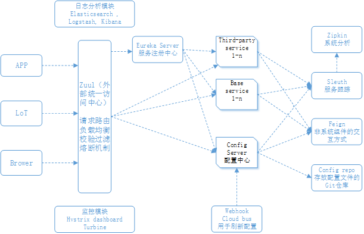
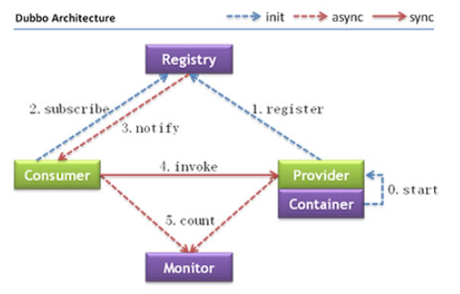

[toc]

# 简介

Spring Boot和Spring Cloud为java开发者提供了一个将传统的、庞大的Spring应用迁移到可以部署到云的微服务应用的简单迁移路径。

## Spring和微服务有什么关联

Spring 已经成为构建基于java应用程序事实上的开发框架。Spring 的核心是基亍依赖注入的概念。在一个正常的 Java 应用里，应用被分解成各种各样的类。每个类经常被应用里其他的类明确的链接。链接就是一个类的构造函数中的代码直接调用。一旦代码被编译， 这些链接点是不能改发的。

这在一个大型项目中是有问题的，因为这些外部链接是脆弱的，迚行更改会导致其他代码的多个下游影响。依赖注入框架，如 Spring，让你通过在应用程序里使用约定（注释） 定义外部对象之间的关系，更方便的管理大型的 java项目，而不是在对象里硬编码对象之间的引用。在应用程序里不同的java 类之间，Spring 作为中介管理它们的依赖。

 Spring 框架具有使人快速上手的优势，它迅速成为企业级应用 java开发人员寻找替代使用 J2EE 技术栈构建应用的一种更轻量级的方式。Spring 框架令人惊奇的是，它的社区生态能够持续发展并坚持自身。Spring 开发团现许多开发团队正在摒弃单体应用程序，这些应用程序的展示、业务和数据访问逻辑被打包在一起，作为单个工件部署。相反，他们正在转移到高度分布式的模型中，这些服务能够构建为可以轻松部署到云上的小型分布式服务，作为回应，Spring开发团队推出了两个项目：Spring Boot和Spring Cloud。

Spring Boot 是重新构想的 Spring 框架。然而它包含了 Spring 的核心特征，Spring Boot 剥离了 Spring 里面许多的“企业级”特性，提供了一个基于 java，面向REST微服务的框架。使用简单的注解，一个 java开发者就可以快速创建一个 REST 微服务，它可以被打包和部署而不需要外部的应用程序容器。

因为微服务已绊成为构建基于云的应用程序的更常见的架构模式之一，Spring 社区为我们提供了 Spring Cloud。Spring Cloud框架使得将微服务部署到私有云或者公有云变得更简单。Spring Cloud 把几种流行的云管理微服务框架整合到共同的框架下，在代码里使用注解使得这些技术的使用和部署变得更容易。

## 什么是Spring Cloud

从零开始微服务设计中所要关心的各种要素是一个惊人的工作量，幸运的是，Spring团队集成了大量进行充分测试的开源项目为Spring子项目，统称为Spring Cloud （https://spring.io/projects/spring-cloud） 。

Spring Cloud把开源公司，如Pivotal，HashiCorp和Netflix交付的产品整合在一起。Spring Cloud 简化了设置和配置这些项目到你的 Spring 应用程序，使你专注于写代码，没有被掩埋在可以构建和部署一个微服务应用的所有基础设施的配置细节里。

Spring Cloud 部分项目总览如下：

| 项目名称                         | 项目职能                                                     |
| -------------------------------- | ------------------------------------------------------------ |
| Spring Cloud Config              | Spring Cloud 提供的分布式配置中心，为外部配置提供了客户端和服务端的支持。 |
| Spring Cloud Netflix             | 与各种Netflix OSS组件集成（Eureka，Hystrix，Zuul，Archaius等）。 |
| Spring Cloud Bus                 | 用于将服务和服务实例与分布式消息传递连接在一起的事件总线。用于跨群集传播状态更改（例如，配置更改事件）。 |
| Spring Cloud Cloudfoundry        | 提供应用程序与 Pivotal Cloud Foundry 集成。提供服务发现实现，还可以轻松实现受SSO和OAuth2保护的资源。 |
| Spring Cloud Open Service Broker | 为构建实现 Open service broker API 的服务代理提供了一个起点。 |
| Spring Cloud Cluster             | 提供Leadership选举，如：Zookeeper, Redis, Hazelcast, Consul等常见状态模式的抽象和实现。 |
| Spring Cloud Consul              | 封装了Consul操作，consul 是一个服务发现与配置工具，与Docker容器可以无缝集成。 |
| Spring Cloud Security            | 基于spring security的安全工具包，为你的应用程序添加安全控制。在Zuul代理中为负载平衡的OAuth2 rest客户端和身份验证头中继提供支持。 |
| Spring Cloud Sleuth              | Spring Cloud 提供的分布式链路跟踪组件，兼容zipkin、HTracer和基于日志的跟踪（ELK） |
| Spring Cloud Data Flow           | 大数据操作工具，作为Spring XD的替代产品，它是一个混合计算模型，结合了流数据与批量数据的处理方式。 |
| Spring Cloud Stream              | 数据流操作开发包，封装了与Redis,Rabbit、Kafka等发送接收消息。 |
| Spring Cloud CLI                 | 基于 Spring Boot CLI，可以让你以命令行方式快速建立云组件。   |
| Spring Cloud OpenFeign           | 一个http client客户端，致力于减少http client客户端构建的复杂性。 |
| Spring Cloud Gateway             | Spring Cloud 提供的网关服务组件                              |
| Spring Cloud Stream App Starters | Spring Cloud Stream App Starters是基于Spring Boot的Spring 集成应用程序，可提供与外部系统的集成。 |
| Spring Cloud Task                | 提供云端计划任务管理、任务调度。                             |
| Spring Cloud Task App Starters   | Spring Cloud任务应用程序启动器是SpringBoot应用程序，它可以是任何进程，包括不会永远运行的Spring批处理作业，并且在有限的数据处理周期后结束/停止。 |
| Spring Cloud Zookeeper           | 操作Zookeeper的工具包，用于使用zookeeper方式的服务发现和配置管理。 |
| Spring Cloud AWS                 | 提供与托管的AWS集成                                          |
| Spring Cloud Connectors          | 便于云端应用程序在各种PaaS平台连接到后端，如：数据库和消息代理服务。 |
| Spring Cloud Starters            | Spring Boot式的启动项目，为Spring Cloud提供开箱即用的依赖管理。 |
| Spring Cloud Contract            | Spring Cloud Contract是一个总体项目，其中包含帮助用户成功实施消费者驱动合同方法的解决方案。 |
| Spring Cloud Pipelines           | Spring Cloud Pipelines提供了一个固定意见的部署管道，其中包含确保您的应用程序可以零停机方式部署并轻松回滚出错的步骤。 |
| Spring Cloud Function            | Spring Cloud Function通过函数促进业务逻辑的实现。 它支持Serverless 提供商之间的统一编程模型，以及独立运行（本地或PaaS）的能力。 |

一个基本的Spring Cloud项目的架构图如下所示：

Spring Cloud提供的能力有如下部分。

### 配置中心

Spring Cloud Config处理应用程序的配置数据的管理，通过一个集中的服务来使你的应用程序配置数据（尤其使你的环境的具体配置数据）从你的部署微服务分离干净，这确保了你无论扩展多少微服务实例，它们总会有相同的配置。

### 服务发现

Spring Cloud的服务发现能够将消费服务为的客户端从服务器部署的物理位置抽离出来，服务消费者通过逻辑名称而不是物理位置调用服务器的业务逻辑。Spring Cloud服务发现还负责在忘启动和停止的时候注册和注销服务实例。Spring Cloud的服务发现可以采用多个开源项目作为服务发现引擎，其中最常用的是Consul和Eureka。

### 容错

Spring Cloud在很大程度商集成了Netflix OSS套件来实现服务的弹性模式。Spring Cloud将Netflix的Hystrix和Ribbon项目集成在一起，在你的微服务中实施它们。

使用Hystrix，可以快速实现服务客户端的弹性模式，如断路器和舱壁模式。

Ribbon提供了来自服务消费者的服务调用的客户端负载均衡，这使得即使服务发现代理暂时不可用，客户端也可以继续进行服务调用。

### 服务网关

服务网关在微服务应用之间提供路由能力，它代理服务请求并确保目标服务调用之前，所有对你的微服务的调用都通过一个单一的”前门“。有了这种集中的服务调用，你可以执行标准的服务策略，如安全授权验证、内容过滤和路由规则。Spring Cloud中可以选择Zuul或者Gateway这两个组件来实现网关功能。

### 异步消息代理

Spring Cloud Stream是一门有利的技术，可以很容易将轻量级消息处理器整合到你的微服务，使用它你可以构建智能的微服务，它可以使用在你的应用程序发生的异步事件，通过Spring Cloud Stream，你能够快速将你的微服务与消息中间件集成，如RabbitMQ、RocketMQ、Kafka等。

### 链路追踪

Spring Cloud Sleuth允许你将唯一的跟踪标识符集成到HTTP调用和在你的应用程序使用的消息通道（RabbitMQ，Appache Kafka）。这些追踪号，有时被称为关联或者追踪ID，允许你跟踪一个交易，因为它在应用程序的不同服务之间传递，Sleuth会自动将追踪ID添加到在微服务中产生的日志。

另外，真正的优势是与日志聚合技术工具如Papertrail和跟踪工具如Zipkin集合。Papertail是一个日志平台，用于将不同微服务实时日志汇总到一个可查询的数据库。Zipkin使用Sleuth产生的数据，允许你可视化一个单一交易的有关联的服务调用流程

### 安全

Spring Cloud Security是一个身份验证和授权框架，它能控制谁可以访问你的服务和它们能为你的服务做些什么？Spring Cloud Security 是基于仓牌的，它允许服务通过一个由身份验证服务器发出的令牌互相通信。每个服务接收到一个调用，可以检查在 HTTP 调用中提供的仓牌，来验证用户的身份和它们访问服务的权限。另外，Spring Cloud Security 支持 JavaScript Web Token。

## 为什么要使用云

基于微服务架极的核心概念之一是每个服务都作为独立的组件被打包和部署。服务实例应该能够快速启动。服务的每个实例之间互不干扰，都应该与其他实例区分开来。

作为一位微服务的开发者，你将不得不决定是否将你的服务部署到如下的环境中：

* 物理服务器：虽然你可以构建和部署你的微服务到物理机，但很少有机构这样做，是因为物理服务器的有限制，你不能快速提升一台物理服务器的处理能力。在多台物理服务器上水平伸缩你的微服务是非常昂贵的。
* 虚拟机镜像：微服务一个关键的好处是它们具有快速启动和关闭服务实例以响应应用伸缩和服务故障事件处理的能力。虚拟机是主要的云计算提供商提供的核心服务。一个微服务可以被打包在一个虚拟机镜像。在任何一个 IaaS 私有云或公共云，服务的多个实例可以快速部署和启动。
* 虚拟容器：虚拟容器是在虚拟机镜像里部署微服务的自然延伸。与其将一个服务部署到一台完整的虚拟机，许多开发者将他们的服务部署到于上的Docker容器（或者等效的容器技术）。虚拟容器运行在一台虚拟机内部；使用虚拟容器，你可以将单个虚拟机分隔成一系列独立的、共享相同的虚拟机镜像的进程。

基于云的微服务的优势是围绍弹性的概念。云服务提供商能够为你提供在几分钟内快速地生成新的虚拟机和容器的能力。如果你的服务需求下降，你可以在不产生任何额外成本的情况下向下收缩虚拟服务器的数量。使用云提供商的设施部署你的微服务能够提高你应用横向扩展的能力（增加更多的服务器和服务实例）。服务器的伸缩性也意味着你的应用程序可以更具弹性。如果你的一个微服务有问题甚至宕机，生成新的服务实例，可以让你的应用程序处于更长的活动状态，使你的开发团队能够更好的解决问题。

所以Spring Cloud通常是与Docker容器结合使用，它的部署哲学如下：

* 简化基础设施管理

  IaaS云提供商给你提供对服务的最大的控制能力，使用简单的API调用，新的服务可以启动和停止。一个IaaS云解决方案，你只需为你使用的基础设施付费。

* 大规模的横向扩展能力

  IaaS云提供商能够让你快速地启动一个服务地一个或多个实例，这种能力意味着你可以快速伸缩服务和绕过有问题或已冗机的服务器。

* 通过地理分布实现高冗余

  IaaS供应商有多个数据中心，通过IaaS云提供商部署你的微服务，你能获得 一个比在数据中心使用集群更高级别的冗余。

# 和其它微服务框架的对比

## 服务治理

微服务架构开始变得火热之后，有了一系列的概念：服务注册与发现，请求链路追踪，服务熔断，服务限流，服务管控配置，服务预警，也有了一系列的开源工具：Eurake，Zuul，Ribbon，hystrix，zipkin，dubbo，Sleuth，Elastic Search，grafna，Promethues。而实际商这些工具都是为了解决一个问题：将分解而成的微服务治理好，而提到服务治理，有如下图中的几个概念。

而所谓的微服务框架就是集成了自己和其他公司的一些开源工具之后经过测试可以稳定运行然后发布出来供更多的开发人员使用的框架，可以看出Spring Cloud能够覆盖服务治理的六大基本模块。基本每个大型互联网公司都有自己的一套微服务框架，就开源项目而言，除了Spring Cloud目前比较活跃的还有Dubbo和Istio，接下来会将这两个项目和Spring Cloud进行对比。

## Dubbo

 Dubbo 是阿里开源的一个 SOA 服务治理解决方案，文档丰富，在国内的使用度非常高 。架构图和其中游戏额节点的信息说明如下。

节点角色说明

| 节点        | 角色说明                               |
| ----------- | -------------------------------------- |
| `Provider`  | 暴露服务的服务提供方                   |
| `Consumer`  | 调用远程服务的服务消费方               |
| `Registry`  | 服务注册与发现的注册中心               |
| `Monitor`   | 统计服务的调用次数和调用时间的监控中心 |
| `Container` | 服务运行容器                           |

可以看出，Dubbo的功能特点如下

- 调用中间层变成了可选组件，消费方可以直接访问服务提供方；
- 服务信息被集中到 Registry 中，形成了服务治理的中心组件；
- 通过 Monitor 监控系统，可以直观地展示服务调用的统计信息；
- 服务消费者可以进行负载均衡、服务降级的选择。

它和Spring Cloud的功能对比如下：

| 功能名称     | Dubbo     | Spring Cloud                 |
| ------------ | --------- | ---------------------------- |
| 服务注册中心 | ZooKeeper | Spring Cloud Netflix Eureka  |
| 服务调用方式 | RPC       | REST API                     |
| 服务网关     | 无        | Spring Cloud Netflix Zuul    |
| 断路器       | 不完善    | Spring Cloud Netflix Hystrix |
| 分布式配置   | 无        | Spring Cloud Config          |
| 服务跟踪     | 无        | Spring Cloud Sleuth          |
| 消息总线     | 无        | Spring Cloud Bus             |
| 数据流       | 无        | Spring Cloud Stream          |
| 批量任务     | 无        | Spring Cloud Task            |

很明显Spring Cloud比Dubbo更加强大，涵盖面更广，而且作为Spring出品的框架，天生和Spirng的众多项目完美融合，使用Dubbo的话还需要去寻找能够弥补Dubbo在服务治理方面缺失功能的组件，这对于技术不是很成熟的公司是一个巨大的挑战。

实际上Dubbo是Spring Cloud功能的一个子集，Dubbo是RPC框架，Dubbo现在也支持集成在Spring Cloud中作为服务治理模块的一部分。

## Istio

Istio 作为用于微服务服务聚合层管理的新锐项目，是 Google、IBM、Lyft 首个共同联合开源的项目，提供了统一的连接，安全，管理和监控微服务的方案。 

目前首个测试版是针对 Kubernetes 环境的，社区宣称在未来几个月内会为虚拟机和 Cloud Foundry 等其他环境增加支持。 Istio 将流量管理添加到微服务中，并为增值功能（如安全性，监控，路由，连接管理和策略）创造了基础。 

Istio的特点如下:

* Istio 适用于容器或虚拟机环境（特别是 k8s），兼容异构架构。

* Istio 使用 sidecard（边车模式）代理服务的网络，不需要对业务代码本身做任何的改动。

* HTTP、gRPC、WebSocket 和 TCP 流量的自动负载均衡。

* Istio 通过丰富的路由规则、重试、故障转移和故障注入，可以对流量行为进行细粒度控制；支持访问控制、速率限制和配额。

* Istio 对出入集群入口和出口中所有流量的自动度量指标、日志记录和跟踪。

从微服务的设计模式来说，Istio是最符合理想愿景的，不限制开发语言和框架，天生基于云平台开发，功能强大。但是它最大的缺点是不易于上手，对于开发人员来说，要学习很多运维方面的东西，而且Istio还没有能应用于生产环境的版本，对于需要实际应用的项目来说，不能保证稳定性是不可接受的事情。

所以总结来说，Spring Cloud是Java领域最适合做微服务的框架，它对于微服务生态的支持力度最大，天然支持Spring Boot，便于业务落地。对于想用微服务架构而人手不足的中小公司更为友好。