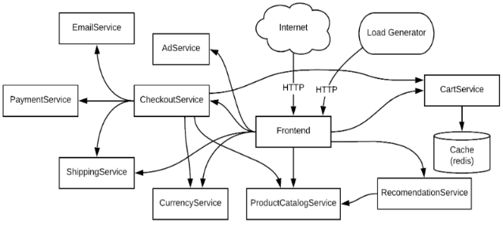

[toc]

# 背景

用于开发服务器端应用程序（如 Java，C / C ++和 Python）的主流语言提供了抽象，可以通过将程序分解为模块来降低复杂度。但是，这些语言是为创建单个应用而设计的，这种传统的架构设计出来的应用称之为单体应用。单体应用 依赖于很多的资源共享（数据库、文件等）。由于一个单体应用中的模块依赖于 所述共享资源，因此它们不是可独立执行的。所以这就会面临如下的一些问题：

* 单体应用不便于维护和持续的更新。追踪错误需要在代码中寻找多层，功能的迭代也需要查看很多关联模块的代码。
* 依赖问题。很多时候不同的模块可能需要不同的依赖库，这些依赖库可能又依赖于互相冲突的库，因此而导致整个程序的无法的编译运行。
* 更新问题。在有几百万代码行的单体应用中，即使只需要修改一行代 码，也需要重新部署整个应用程序才能够发布该变更。这种部署的影响大、成本高，因此在实际操作中重新部署的频率是很低的。这意味着在两次发布之间系统可能已经进行了多次更新，但直到积累了很多功能的改变之后才将这些变更一次性发布到生产环境中。这样做会 有两个缺点，一个是不能够即使的更新功能；另一个是两次发布的版 本之间的差异越大，出错的可能性就越大。
* 限制了可拓展性。当某个功能模块使用的次数增加时，我们希望的是这个模块能够多运行几个，但这在单体应用中是做不到的，只能够将整个程序再部署到一个或多个机器上进行负载均衡，这就造成了很多 硬件资源的浪费。
* 限制了开发的语言和框架。由于是一个程序，肯定要保证语言和框架的一致性，对于一个团队来说，所要掌握的技术栈也是差不多的，不能够很好的发挥出不同语言的优势。

在谈到微服务架构之前，不得不提到 SOA（Service Oriented Architecture），即“面向服务的架构”：它是一种设计方法，它将一个系统设计为包含多个服务，服务之间通过相互依赖最终提供一系列的功能。一个服务通常以独立的形式存在 操作系统进程中，而为了集成不同系统、不同协议的服务，需要有 ESB（企业服 务总线）来做转化和解释工作，让不同的服务能够互联互通。SOA 提出的目标主要目的是解决功能模块的复用问题，很多业务的业务逻辑存在重合点，将业务逻辑抽象成可复用、可组装的服务之后，可以通过服务的编排实现业务的快速开发。但是它有个很大的问题是太依赖于中心化的管理，而且没有做到彻底的服务化和组件化，仍然有很多单体应用的缺陷，在服务驱动的设计激励下，微服务架构的设计方法在 SOA的基础上迭代产生。

# 定义

微服务就是一些协同工作的小而自治的服务。深入阐述如下：

* 很小，专注于一件事情。在之前所说的单体系统中，会用模块来保证代码的内聚性，那么将这个理念应用在微服务设计上，“把因相同原因而变化的东西聚合在一起，而把因不同原因而变化的东西分离开来”，所以根据业务的边界来确定服务的边界。

* 自治性。一个微服务就是一个独立的实体，它可以独立地部署在PAAS 上，也可以作为一个操作系统进程存在。要尽量避免把多个服务部署到同一台机器上，这样能够大大简化分布式系统的构建。服务之间均通过网络调用进行通信，从而加强了服务之间的隔离性，避免了紧耦 合。

举个例子来说，考虑用来进行付款的服务。要成为微服务，它应该提供可以通过消息请求的付款功能，并将结果通过消息队列传递出去，但是它不应该有其他的功能，比如支付过程中要操作用户购买的库存，支付成功后要对订单进行操作。从技术角度上来说，微服务应该是概念上的部署的独立部件，彼此之间隔离 并且配备单独的持久化工具（数据库等）。 在微服务的概念基础上来定义微服务架构的概念：微服务架构是指一个分布式的应用程序，它的所有模块都是微服务。

# 优势

相对于单体应用来说，微服务架构有很多优势，其中的很多好处也适用于任何一个分布式系统，但是相对于分布式系统或者传统面向服务的架构来说，微服务架构会把这些优势推向极致。

## 技术异构性

在一个由多个服务相互协作的系统中，可以在不同的服务中使用最适合该服务的技术。如果某一部分需要性能升级，可以使用性能更好的技术栈重新构建该部分。系统中的不同部分也可以使用不同的数据存储技术，比如对于社交网络来说，图数据库能够更好地处理用户之间地交互操作，但是对于用户发布的帖子而言，文档数据库可能是一个更好的选择。

而且微服务架构能帮助开发人员更快地使用新技术，并且理解这些新技术地好处。尝试这些新技术通常伴随着风险，尤其对于单体系统来说，采用一个新的语言、数据库或者框架都会对整个系统产生巨大的影响。而对于一个微服务架构 的系统来说，总存在一些地方可以去尝试新技术，在业务快速迭代的今天，能够快速的采用新技术的能力对于很多公司来说是很有价值的。如下图所示，这是 Google 开源的一个商城项目的架构，对于其中的每一个微服务都使用了不同的 语言和框架，Java、Python、Go、Scala、Erlang、C++、Ruby等等，充分体现了微服务架构在技术异构上的优势。

## 弹性

弹性工程学的一个关键概念是舱壁。如果系统中的一个组件不可用了，但并没有导致级联故障，那么系统的其他部分还可以正常运行。服务边界就是一个很显然的舱壁。在单块系统中，如果一个模块不可用，那么所有的功能都会不可用。对于单块服务的系统而言，可以通过将同样的实例运行在不同的机器上来降低功能完全不可用的概率，然而微服务系统本身就能够很好地处理服务不可用和功能降级问题。只要使用了分布式系统，网络和机器的故障就是不可避免的， 微服务架构的系统相对于传统分布式系统的优势是微服务架构的系统中会有服务的注册和发现中心，而且强调了每个服务调用其它微服务未成功时要有降级处理的措施，这个措施一般有多层，最后一层是不依靠网络的，能够一定程度上降低网络或机器故障对整体系统带来的影响。

## 可扩展性

使用较小的多个服务，当系统出现性能瓶颈时，只需要对需要扩展的服务进行扩展，这样就可以将那些不需要扩展的服务运行在更小的、性能稍差的硬件上， 这样可以更好的处理流量，而且也会节约成本。

## 简化部署

在微服务架构中，各个服务的部署是独立的，这样就可以更快地对特定部分的代码进行部署。如果真的出了问题，也会只影响一个服务，并且容易快速回滚， 这也意味着客户可以更快的体验到产品的新特性。这种架构也会更好的消除软件 发布过程中的种种障碍。

## 可组合性

面向服务的架构的主要优势是易于重用已有功能。而在微服务架构中，由于之前提到的技术异构性，这种优势进一步放大，根据不同的目的，人们可以通 过不同的方式使用同一个功能，在考虑客户如何使用软件这一点尤为重要，单纯考虑桌面网站或者移动 app 的时代已经过去了。现在需要考虑的应用程序种类包 括Web、客户端应用、移动端Web、移动端 app 和可穿戴设备等，针对每一种都应该考虑如何对已有的功能进行组合来实现这些应用。微服务架构可以辅助很好的实现这一点，每个微服务会开放很多接缝供系统内的其他微服务使用。当面对不同的情况时，可以使用不同的方法构建应用，而整体化的应用程序只提供一个粗粒度的接口表现在外部。

## 可替代性

即使最终通过微服务架构构建的系统的代码量还要超过一个单体应用，但是对于每个微服务来说，代码库可能只有几百行，所以重写或者移除一个或多个服务的阻碍也很小。