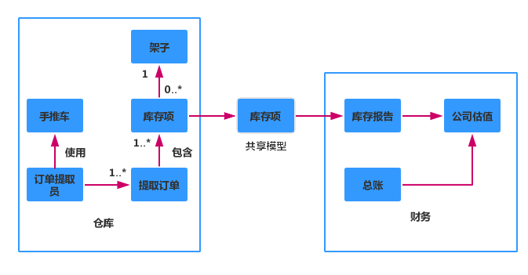
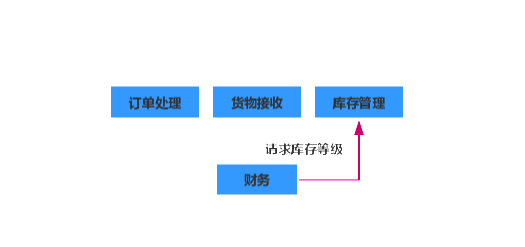
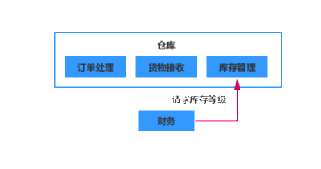
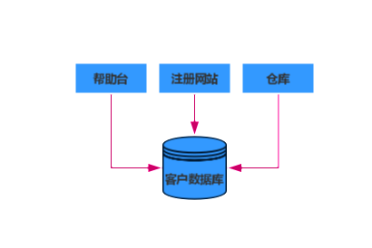
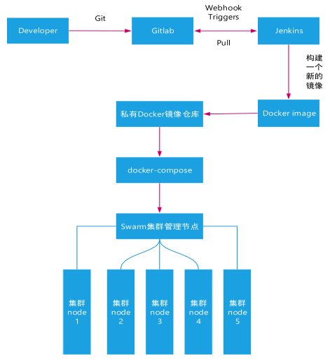
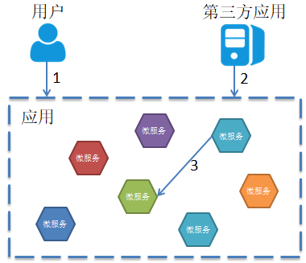

[toc]

# 建模

## 什么是好的微服务

高内聚和松耦合在不同的上下文中被大量使用，尤其是在面向对象编程中。而这两个概念在微服务中有不同的含义。

**松耦合**

如果做到了服务之间的松耦合，那么修改一个服务就不需要修改另一个服务。使用微服务最重要的一点是，能够独立修改及部署单个服务而不需要修改系统的其他部分，这真的非常重要。什么会导致紧耦合呢？一个典型的错误是，使用紧耦合的方式做服务之间的集成，从而使得一个服务的修改会致使其消费者的修改。一个松耦合的服务应该尽可能少地知道与之协作的那些服务的信息。这也意味着，应该限制两个服务之间不同调用形式的数量，因为除了潜在的性能问题之外，过度的通信可能会导致紧耦合。

**高内聚**

我们希望把相关的行为聚集在一起，把不相关的行为放在别处。为什么呢？因为如果你要改变某个行为的话，最好能够只在一个地方进行修改，然后就可以尽快地发布。如果需要在很多不同的地方做这些修改，那么可能就需要同时发布多个微服务才能交付这个功能。 在多个不同的地方进行修改会很慢，同时部署多个服务风险也很高，这两者都是我们想要避免的。

所以，找到问题域的边界就可以确保相关的行为能放在同一个地方，并且它们会和其他边界以尽量松耦合的形式进行通信。

## 限界上下文

Eric Evans的《领域驱动设计》一书引入的一个很重要的概念是限界上下文（bounded context）。作者认为任何一个给定的领域都包含多个限界上下文，每个限界上下文中的模型分成两部分，一部分不需要与外部通信，另一部分则需要。每个上下文都有明确的接口，该接口决定了它会暴露哪些模型给其他的上下文。另一个限界上下文的定义是：“一个由显式边界限定的特定职责。” 如果你想要从一个限界上下文中获取信息，或者向其发起请求，需要使用模型和它的显式边界进行通信。使用细胞作为比喻：“细胞之所以会存在，是因为细胞膜定义了什么在细胞内，什么在细胞外，并且确定了什么物质可以通过细胞膜。”

举一个和运营相关的业务为例子。此业务涵盖了从仓储到前台、从财务到订单的所有元素。这些元素就是领域，尽管我们不一定要对所有的元素进行建模。我们首先尝试在领域中寻找限界上下文。在此例中，仓库负责管理发出去的订单（及退回的剩余产品），接收新到的库存，保证多个铲车能同时正常运行等。财务部的员工负责管理工资单和公司的账户，并生成重要的报表，这些报表的数量相当大。

对于此业务来说，财务部门和仓库就可以是两个独立的限界上下文。它们都有明确的对外接口（在存货报告、工资单等方面），也都有着只需要自己知道的一些细节（铲车、 计算器）。财务部门不需要知道仓库的内部细节。但它确实也需要知道一些事情，比如，需要知道库存水平以便于更新账户。下图展示了一个上下文图表示例。可以看到其中包含了仓库的内部概念，比如订单提取员、货架等。类似地，公司的总账是财务部必备的一部分，但是不会对外共享。为了算出公司的估值，财务部的雇员需要库存信息，所以库存项就变成了两个上下文之间的共享模型。然而，我们不会盲目地把库存项在仓库上下文中的所有内容都暴露出去。比如，尽管在仓库内部有相应的模型来表示库存项，但是我们不会直接把这个模型暴露出去。也就是对该模型来说，存在内部和外部两种表示方式。

有时候，同一个名字在不同的上下文中有着完全不同的含义。比如，退货表示的是客户退回的一些东西。在客户的上下文中，退货意味着打印运送标签、寄送包裹，然后等待退款。在仓库的上下文中，退货表示的是一个即将到来的包裹，而且这个包裹会重新入库。 退货这个概念会与将要执行的任务相关，比如我们可能会发起一个重新入库的请求。这个退货的共享模型会在多个不同的进程中使用，并且在每个限界上下文中都会存在相应的实体，不过，这些实体仅仅是在每个上下文的内部表示而已。

明白应该共享特定的模型，而不应该共享内部表示这个道理之后，就可以避免潜在的紧耦合风险。我们还识别出了领域内的一些边界，边界内部是相关性比较高的业务功能，从而得到高内聚。这些限界上下文可以很好地形成组合边界。

在同一个进程内使用模块来减少彼此之间的耦合也是一种选择。刚开始开发一个代码库的时候，这可能是比较好的办法。所以一旦你发现了领域内部的限界上下文，一定要使用模块对其进行建模，同时使用共享和隐藏模型。
这些模块边界就可以成为绝佳的微服务候选。

一般来讲，微服务应该清晰地和限界上下文保持一致。如果服务边界和领域的限界上下文能保持一致，并且微服务可以很好地表示这些限界上下文的话，那么就已经迈出了高内聚低耦合的微服务架构的第一步。

很多时候直接使用微服务架构是不适合的，如果边界定义错误想要修正回来，会导致很多跨服务的修改，而这些修改的代价相当高。ThoughtWorks认为过早将一个系统划分成为微服务的代价非常高，尤其是在面对新领域时。很多时候，将一个已有的代码库划分成微服务，要比从头开始构建微服务简单得多。

## 业务功能

当你在思考组织内的限界上下文时，不应该从共享数据的角度来考虑，而应该从这些上下文能够提供的功能来考虑。比如，仓库的一个功能是提供当前的库存清单，财务上下文能够提供月末账目或者为一个新招的员工创建工资单。为了实现这些功能，可能需要交换存储信息的模型，但是只考虑模型会导致贫血的、基于 CRUD（create，read， update，delete）的服务。所以首先要考虑“这个上下文是做什么用的”，然后再考虑它需要什么样的数据。

## 逐步划分上下文

一开始你会识别出一些粗粒度的限界上下文，而这些限界上下文可能又包含一些嵌套的限 界上下文。举个例子，你可以把仓库分解成为不同的部分：订单处理、库存管理、货物接 受等。当考虑微服务的边界时，首先考虑比较大的、粗粒度的那些上下文，然后当发现合适的缝隙后，再进一步划分出那些嵌套的上下文。到底是使用哪种方法呢。

如果订单处理、库存管理及货物接收是由不同的团队维护的，那么他们大概会希望这些服务都是顶层微服务。如下图所示。

另一方面，如果它们都是由一个团队管理的，那么嵌套式结构会更合理。其原因在于，组织结构和软件架构会互相影响。

## 关于业务概念的沟通

修改系统的目的是为了满足业务需求。我们会修改面向客户的功能。如果把系统分解成为限界上下文来表示领域的话，那么对于某个功能所要做的修改，就更倾向于局限在一个单 独的微服务边界之内。这样就减小了修改的范围，并能够更快地进行部署。

微服务之间如何就同一个业务概念进行通信，也是一件很重要的事情。基于业务领域的软件建模不应该止于限界上下文的概念。在组织内部共享的那些相同的术语和想法，也应该被反映到服务的接口上。以跟组织内通信相同的方式，来思考微服务之间的通信形式是非常有用的。事实上，通信形式在整个组织范围内都非常重要。

# 微服务集成

集成是微服务相关技术中最重要的一个。做得好的话，你的微服务可以保持自治性，你也可以独立地修改和发布它们。但做得不好的话会带来灾难。

## 理想的集成技术

微服务之间通信方式的选择非常多样化， 如SOAP、RPC 、REST 、Protocol Buffers ，理想的集成技术需要如下的特性。

* 避免破坏性修改

  有时候，对某个服务做的一些修改会导致该服务的消费方也随之发生改变。希望选用的技术可以尽量避免这种情况的发生。比如，如果一个微服务在一个响应中添加了一个字段，那么已有的消费方不应该受到影响。

* 保证API的技术无关性

  新的工具、框架、语言层出不穷，它们使我们的工作更高效。保证微服务之间通信方式的技术无关性是非常重要的。这就意味着不应该选择那种对微服务的具体实现 技术有限制的集成方式。

* 使服务易于消费方使用

  消费方应该能很容易地使用我们的服务。理想情况下，消费方应该可以使用任何技术来实现，从另一方面来说，提供一个客户端库也可以简化消费方的使用。但是通常这种库与其他我们想要得到的东西不可兼得。 举个例子，使用客户端库对于消费方来说很方便，但是会造成耦合的增加。

* 隐藏内部实现细节

  不希望消费方与服务的内部实现细节绑定在一起，因为这会增加耦合。与细节绑定意味着，如果想要改变服务内部的一些实现，消费方就需要跟着做出修改。这会增加修改的成本，而这恰恰是我们想要避免的。这也会导致为了避免消费方的修改而尽量少地对服务本身进行修改，而这会导致服务内部技术债的增加。所以，所有倾向于暴露内部实现细节的技术都不应该被采用。

我们举一个创建客户的业务作为例子帮助学习。创建客户这个业务，乍一看似乎就是简单的 CRUD 操作，但对于大多数系统来说并不止这些。添加新客户可能会触发一个新的流程，比如进行付账设置、发送欢迎邮件等。而且修改或者删除客户也可能会触发其他的业务流程。

## 共享数据库

目前为止，我和同事在业界所见到的最常见的集成形式就是数据库集成。使用这种方式时，如果其他服务想要从一个服务获取信息，可以直接访问数据库。如果想要修改，也可以直接在数据库中修改。这种方式看起来非常简单，而且可能是最快的集成方式，这也正 是它这么流行的原因。

下图展示了注册部分的用户界面，它直接使用 SQL 在数据库中创建用户。还可以看到， 呼叫中心应用程序可以直接运行 SQL 来查看和编辑数据库中的数据。仓库通过查询数据库 来显示更新后的客户订单信息。这是一种非常普通的模式，但实践起来却困难重重。

首先，这使得外部系统能够查看内部实现细节，并与其绑定在一起。存储在数据库中的数据结构对所有人来说都是平等的，所有服务都可以完全访问该数据库。如果我决定为了更好地表示数据或者增加可维护性而修改表结构的话，我的消费方就无法进行工作。数据库是一个很大的共享 API，但同时也非常不稳定。如果我想改变与之相关的逻辑，比如说帮助台如何管理客户，这就需要修改数据库。为了不影响其他服务，我必须非常小心地避免修改与其他服务相关的表结构。这种情况下，通常需要做大量的回归测试来保证功能的正确性。

其次，消费方与特定的技术选择绑定在了一起。可能现在来看，使用关系型数据库做存储是合理的，所以我的消费方会使用一个合适的驱动（很有可能是与具体数据库相关的）来 与之一起工作。说不定一段时间之后我们会意识到，使用非关系型数据库才是更好的选择。如果消费方和客户服务非常紧密地绑定在了一起，那么能够轻易替换这个数据库吗？ 正如前面所讨论的，隐藏实现细节非常重要，因为它让我们的服务拥有一定的自治性，从而可以轻易地修改其内部实现。

最后，让我们考虑一下行为。肯定会有一部分逻辑负责对客户进行修改。那么这个逻辑应该放在什么地方呢？如果消费方直接操作数据库，那么它们都需要对这些逻辑负责。对数据库进行操作的相似逻辑可能会出现在很多服务中。如果仓库、注册用户界面、呼叫中心都需要编辑客户的信息，那么当修复一个 bug 的时候，你需要修改三个不同的地方，并且对这些修改分别做部署。

还记得前面提到过的关于好的微服务的核心原则吗？没错，就是高内聚和低耦合。但是使用数据库集成使得这两者都很难实现。服务之间很容易通过数据库集成来共享数据，但是无法共享行为。内部表示暴露给了我们的消费方，而且很难做到无破坏性的修改，进而不 可避免地导致不敢做任何修改，所以无论如何都要避免这种情况。

在本章的剩余部分中，我们会介绍服务之间不同风格的集成方式，这些方式都可以保证服务的内部实现得以隐藏。

## 同步和异步

在介绍具体的技术选择之前，让我们先就服务如何协作这个问题做一些讨论。服务之间的通信应该是同步的还是异步的呢？这个基础性的选择会不可避免地引导我们使用不同 的实现。

如果使用同步通信，发起一个远程服务调用后，调用方会阻塞自己并等待整个操作的完 成。如果使用异步通信，调用方不需要等待操作完成就可以返回，甚至可能不需要关心这 个操作完成与否。

同步通信听起来合理，因为可以知道事情到底成功与否。异步通信对于运行时间比较长的 任务来说比较有用，否则就需要在客户端和服务器之间开启一个长连接，而这是非常不实 际的。当你需要低延迟的时候，通常会使用异步通信，否则会由于阻塞而降低运行的速 度。对于移动网络及设备而言，发送一个请求之后假设一切工作正常（除非被告知不正 常），这种方式可以在很大程度上保证在网络很卡的情况下用户界面依然很流畅。

这两种不同的通信模式有着各自的协作风格，即请求/响应或者基于事件。对于请求/响应来说，客户端发起一个请求，然后等待响应。这种模式能够与同步通信模式很好地匹配，但异步通信也可以使用这种模式。我可以发起一个请求，然后注册一个回调，当服务端操作结束之后，会调用该回调。对于使用基于事件的协作方式来说，情况会颠倒过来。客户端不是发起请求，而是发布一个事件，然后期待其他的协作者接收到该消息，并且知道该怎么做。我们从来不会告知任何人去做任何事情。基于事件的系统天生就是异步的。整个系统都很聪明，也就是说，业务逻辑并非集中存在于某个核心大脑，而是平均地分布在不同的协作者中。基于事件的协作方式耦合性很低。客户端发布一个事件，但并不需要知道谁或者什么会对此做出响应，这也意味着，你可以在不影响客户端的情况下对该事件添加新的订阅者。

## 远程过程调用（RPC）

远程过程调用允许你进行一个本地调用，但事实上结果是由某个远程服务器产生的。RPC 的种类繁多，其中一些依赖于接口定义（SOAP、Thrift、protocol buffers 等）。不同的技术栈可以通过接口定义轻松地生成客户端和服务端的桩代码。举个例子，我可以让一个 Java 服务暴露一个 SOAP 接口，然后使用WSDL（Web Service Definition Language，Web 服务 描述语言）定义的接口生成 .NET 客户端的代码。其他的技术，比如 Java RMI，会导致服 务端和客户端之间更紧的耦合，这种方式要求双方都要使用相同的技术栈，但是不需要额 外的共享接口定义。然而所有的这些技术都有一个核心特点，那就是使用本地调用的方式 和远程进行交互。
有很多技术本质上是二进制的，比如 Java RMI、Thrift、protocol buffers 等，而 SOAP 使用 XML作为消息格式。有些 RPC 实现与特定的网络协议相绑定（比如 SOAP 名义上使用的 就是 HTTP），当然不同的实现会使用不同的协议，不同的协议可以提供不同的额外特性。 比如 TCP 能够保证送达，UDP 虽然不能保证送达但协议开销较小，所以你可以根据自己 的使用场景来选择不同的网络技术。
那些 RPC 的实现会帮你生成服务端和客户端的桩代码，从而让你快速开始编码。基本不用花时间，我就可以在服务之间进行内容交互了。

但是RPC的实现也确实存在一些问题。

* 技术的耦合

  有一些 RPC 机制，如 Java RMI，与特定的平台紧密绑定，这对于服务端和客户端的技术 选型造成了一定限制。Thrift 和 protocol buffers 对于不同语言的支持很好，从而在一定 程度上减小了这个问题的影响。但还是要注意，有时候 RPC 技术对于互操作性有一定的 限制。 从某种程度上来讲，这种技术上的耦合也是暴露内部实现细节的一种方式。

* 本地调用和远程调用并不相同

  RPC 的核心想法是隐藏远程调用的复杂性。但是很多 RPC 的实现隐藏得有些过头了，进 而会造成一些问题。使用本地调用不会引起性能问题，但是 RPC 会花大量的时间对负荷进 行封装和解封装，更别提网络通信所需要的时间。这意味着，要使用不同的思路来设计远 程和本地的 API。简单地把一个本地的 API 改造成为跨服务的远程 API 往往会带来问题。 最糟的情况是，开发人员会在不知道该调用是远程调用的情况下对其进行使用。
  
  你还需要考虑网络本身。即使客户端和 服务端都正常运行，整个调用也有可能会出错。这些错误有可能会很快发生，也有可能会 过一段时间才会显现出来，它们甚至有可能会损坏你的报文。你应该做出一个假设：有一 些恶意的攻击者随时有可能对网络进行破坏，因此网络的出错模式也不止一种。服务端 可能会返回一个错误信息，或者是请求本身就是有问题的。你能够区分出不同的故障模 式吗？如果可以，分别如何处理？如果仅仅是因为远程服务刚刚启动，所以响应才会有点 慢，该怎么办？

如果要选用 RPC 这种方式的话，需要注意一些问题：不要对远程调用过度抽象，以至于网络因素完全被隐藏起来；确保你可以独立地升级服务端的接口而不用强迫客户端升级，所以在编写客户端代码时要注意这方面的平衡；在客户端中一定不要隐藏是在做网络调用这个事实。

## REST

REST 是受 Web 启发而产生的一种架构风格。REST 风格包含了很多原则和限制，但是这里我们仅仅专注于，如何在微服务的世界里使用 REST 更好地解决集成问题。REST 是 RPC 的一种替代方案。

其中最重要的一点是资源的概念。资源，比如说 Customer，处于服务之内。服务可以根据请求内容创建Customer 对象的不同表示形式。也就是说，一个资源的对外显示方式和内部存储方式之间没有什么耦合。举个例子，客户端可能会请求一个 Customer 的 JSON 表示形 式，而 Customer 在内部的存储方式可以完全不同。一旦客户端得到了该 Customer 的表示， 就可以发出请求对其进行修改，而服务端可以选择应答与否。

REST 本身并没有提到底层应该使用什么协议，尽管事实上最常用 HTTP。我以前也见过使用其他协议来实现 REST 的例子，比如串口或者 USB，当然这会引入大量的工作。 HTTP 的一些特性，比如动词，使得在 HTTP 之上实现 REST 要简单得多，而如果使用其他协议的话，就需要自己实现这些特性。

HTTP 本身提供了很多功能，这些功能对于实现 REST 风格非常有用。比如说 HTTP 的动词（如 GET、POST 和 PUT）就能够很好地和资源一起使用。事实上，REST 架构风格声明了一组对所有资源的标准方法，而 HTTP 恰好也定义了一组方法可供使用。GET 使用幂等的方式获取资源，POST 创建一个新资源。这就意味着，我们可以避免很多不同版本的 createCustomer 及 editCustomer 方法。相反，简单地 POST 一个 Customer 的表示到服务 端，然后服务端就可以创建一个新的资源，接下来可以发起一个 GET 请求来获取资源的表示。从概念上来说，对于一个 Customer 资源，访问接口只有一个，但是可以通过 HTTP 协议的不同动词对其进行不同的操作。

HTTP 周边也有一个大的生态系统，其中包含很多支撑工具和技术。比如 Varnish 这样的 HTTP 缓存代理、mod_proxy 这样的负载均衡器、大量针对 HTTP 的监控工具等。这些组件可以帮助我们很好地处理 HTTP 流量，并使用聪明的方式对其进行路由，而且这些操作基本上都对终端用户透明。HTTP 还提供了一系列安全控制机制供我们直接使用。从基本认证到客户端证书，HTTP 生态系统提供了大量的工具来简化安全性处理。

但同时，基于HTTP的REST也有其缺点。

从易用性角度来看，基于 HTTP 的 REST 无法帮助你生成客户端的桩代码.

有些 Web 框架无法很好地支持所有的 HTTP 动词。这就意味着你很容易处理 GET 和 POST 请求，但是 PUT 和 DELETE 就很麻烦了。

性能上也可能会遇到问题。基于 HTTP 的 REST 支持不同的格式，比如 JSON 或者二进制， 所以负载相对 SOAP 来说更加紧凑，当然和像 Thrift 这样的二进制协议是没法比的。在要求低延迟的场景下，每个 HTTP 请求的封装开销可能是个问题。

## 基于事件的异步协作方式

事件驱动的系统看起来耦合非常低，而且伸缩性很好。但是这种编程风格也会带来一定的复杂性，这种复杂性并不仅仅包括对消息的发布 订阅操作。举个例子，考虑一个非常耗时的异步请求 / 响应，需要考虑响应返回时需要怎 么处理。该响应是否回到发送请求的那个节点？如果是的话，节点服务停止了怎么办？如果不是，是否需要把信息事先存储到某个其他地方，以便于做相应处理？

需要确保各个流程有很好的监控机制，并考虑使用关联 ID，这种机制可以帮助你对跨进程的请求进行追踪。

# 部署

部署一个单块系统的流程非常简单。然而在众多相互依赖的微服务中，部署却是完全不同的情况。

## 持续集成

CI（持续集成）和CD（持续交付）已经出现很多年了，但是在微服务架构中要做CI 和 CD，还是有很多不同之处的。 当持续集成遇到微服务时，需要考虑的如何把 CI 的构建和每个微服务联系起来，即要在微服务、CI 构建和源代码之间建立合适的映射。现在比较主流的方法是让每个微服务都有自己的代码库，分别与相应的 CI 绑定。当对代码库进行修改时，可以只运行相关的构建及其中的测试。最终只会得到一个需要部署的构 建物，代码库与团队所有权的匹配程度也更高了。如果你对一个服务负责，就应该同时对相关的代码库和构建负责。 Jez Humble 和 Dave Farley 对持续交付是这样描述的：CD 能够检查每次提交是否达到了部署到生产环境的要求，并持续地把这些信息反馈给我们，它会把每次提交当初候选发布版本来对待。整个过程是一个流水线：编译及快速测试、 耗时测试、用户验收测试、性能测试，最后部署到生产环境。在微服务的世界，每个微服务的构建物都沿着上述的流水线进行移动，只是构建物的大小和形态会有很大的差别。

## 环境

当软件在 CD 流水线的不同阶段之间移动时，它也会被部署到不同的环境中。如果考虑上图中所示的构建流水线，其中起码存在 4 个环境：一个用来运行耗时测试，一个用来做 UAT，一个用来做性能测试，另一个用于生产环境。我们的微服务构建物从头到尾都是一样的，但环境不同。至少它们的主机是隔离的，配置也不一样。而事实上情况往往会复杂 得多。这些环境之间的不同可能会引 起一些问题。管理单块系统的环境很具有挑战性，尤其是当你对那些很容易自动化的系统没有访问权的时候。当你需要对每个微服务考虑多个环境时，事情会更加艰巨。

## 服务配置

服务需要一些配置。理想情况下，这些配置的工作量应该很小，而且仅仅局限于环境间的不同之处，比如用来连接数据库的用户名和密码。应该最小化环境 间配置的差异。如果你的配置修改了很多服务的基本行为，或者不同环境之间的 配置差异很大，那么就只能在一套环境中发现某个特定的问题，这是很不合理的事情。而且服务的配置信息相对来说是容易改变的，可以使用配置服务器和 git 上的配置仓库结合来存储所有的服务配置信息，当配置信息有变更时，能够让服 务自动刷新配置，这样就可以避免配置信息改变使也需要重新部署服务。

## 云平台

Docker 是构建在轻量级容器之上的平台，可以处理大部分与容器管理相关 的事情，还可以缓解过多服务进行本地开发和测试的问题。Docker 并不能解决所有的问题，还需要一些工具来帮助跨多台主机管理 Docker 实例上的服务， 调度层的一个关键需求是，当你向其请求一个容器时会帮你找到相应的容器运行它。在这个领域，Kubernetes 已经成为了工业界的主流选择。

# 规模化微服务

使用微服务架构的很大一部分原因是因为它的可扩展性，随着微服务架构变 得越来越复杂，微服务的数量由几个变为成百上千之后，会面临很多问题。

## 拥抱故障

首先就是故障，硬盘可能会损坏，软件可能会崩溃，网络也是不可靠的，还有各种的偶然因素。尽管可以尽力去限制引起故障的因素，但是从统计学上看， 规模化后故障将成为必然事件。所以，既然买最好的工具，最昂贵的硬件也无法 避免它们会发生故障的事实，何不换一种思维去面对故障。为故障做好处理的准 备而不是过多的在意单节点的弹性。 构建一个弹性系统，尤其是当功能分散在多个不同的、有可能宕掉的微服务上时，重要的是能够安全地降级功能。举一个例子，在我自己开发的一个服务购 买商城的页面中，我需要几个微服务联合发挥作用。一个微服务显示出售服务的 详细信息，另一个显示用户信息，还有一个负责购物车的显示，还有一个是来给 用户推荐服务的推荐系统微服务。现在，如果这些微服务中的任何一个宕掉，都会导致整个Web页面不可用，那么该系统的弹性还不如只使用一个服务的系统。

因此需要做的是恰当地降级功能，功能降级的意思是在业务逻辑中包含了这个功 能不可用时应该如何做，特别是对于使用网络和操作数据库的行为来说，这是很有用的。比如购物车微服务不可用的话，可能会有很多事情无法完成，但是可以简单的将购物车部分的图标先替换为一个加载中的图标，然后将服务的列表的显示出来，这样的话对于用户来说，他不会得到一个无法使用的提示，还是可以进行其它的操作。对简单的单块应用程序来说，系统不是好的，就是坏的。但对于微服务架构，需要考虑更多微妙的情况，很多情况下，需要做的往往不是技术决策，而是一种业务上的考虑。当购物车微服务发生故障时，除非理解了业务的上下文，否则我们不知道该采取什么行动。比如，也许关闭整个网站，也许把用户界面上的购物车控件变成一个别的提示图片。所以对于产品经理来说，对于每一 个使用多个微服务的面向用户的界面来说，都要考虑其中的每个微服务故障时应该做出如何的业务处理。

Ariel Tseitlin 介绍了 Netflix 是如何运作的。Netflix 完全是基于 AWS 的基础设施的，它的经营规模也是非常庞大的。这两个因素意味着，它必须很好地应对故障。实际上 Netflix 通过引发故障来确保其系统的容错性。一些公司喜欢组织游戏日，在那天系统会被关掉以模拟故障发生，然后不同团队演练如何应对这种情况。Netflix 每天都在生产环境中通过编写程序引发故障。这些项目中最著名的是混乱猴子（Chaos Monkey），在一天的特定时段随机停掉服务器或机器。 知道这可能会发生在生产环境，意味着开发人员构建系统时不得不为它做好准备。混乱猴子只是 Netflix 的故障机器人猴子军队（Simian Army）的一部分。混乱大猩猩（Chaos Gorilla）用于随机关闭整个可用区（AWS 中对数据中心的叫法）， 而延迟猴子（Latency Monkey）在系统之间注入网络延迟。Netflix 已使用开源代 码许可证开源了这些工具。对许多人来说，你的系统是否真的健壮的终极验证是， 在你的生产环境上释放自己的猴子军队。通过让软件拥抱和引发故障，并构建系统来应对，这只是 Netflix 做的一部分事情。它还知道当失败发生后从失败中学习的重要性，并在错误真正发生时采用不指责文化。作为这种学习和演化过程的一部分，开发人员被进一步授权，他们每个人都需要负责管理他的生产服务。通过引发故障，并为其构建系统，Netflix 已经确保它的系统能够更好地规模化以及支持其客户的需求。

## 服务发现

拥有很多的微服务之后，就要考虑如何将这些微服务充分利用起来，想利用 这些微服务首先要知道它们在哪，这就是服务发现。服务发现有很多的用途，也许是想知道在特定环境下有哪些微服务在运行，据此才能知道哪些应该被监测；也许是以便其消费者知道在哪里能找到它；或许是想方便组织里的开发人员了解哪些 API 可用，以避免他们重新发明轮子。从广义上来说，上述所有用例都属于服务发现。与微服务世界中的其他问题类似，我们有很多不同的选项来处理它。目前有很多组织提供了解决方案，比如Zookeeper、Consul、Eureka、Ectd 等等。它们都会把事情分成两部分进行处理。首先，它们提供了一些机制，让一个实例 注册并告诉所有人：“我在这里！”其次，它们提供了一种方法，一旦服务被注册 就可以找到它。然后，当考虑在一个不断销毁和部署新实例的环境中，服务发现会变得更复杂。

## 自动伸缩

利用某些管理工具（比如 Kubernetes）完全自动化的创建虚拟主机和部署微服务是对微服务进行自动伸缩的基本条件。可能系统的负载高峰是从上午 9 点到下午 5 点，因此可以在早上 8：45 启动额外的实例，然后在下午 5：15 关掉这些不再需要规模化微服务的实例以节省开支。另一方面，可以响应式地进行负载 调整，比如在负载增加或某个实例发生故障时，来增加额外的实例，或在不需要时移除它们。关键是要知道一旦发现有上升的趋势，能够多快完成扩展。如果只能在负载增加的前几分钟得到消息，但是扩展至少需要10分钟，那么需要保持额外的容量来弥合这个差距。良好的负载测试套件在这里是必不可少的。可以使用它们来测试自动伸缩规则。如果没有测试能够重现触发伸缩的不同负载，那么只能在生产环境上发现规则的错误，但这时的后果不堪设想。新闻网站是一个很好的混合使用预测型伸缩和响应型伸缩的例子。能清楚地看到其日常趋势，从早晨一直到午餐时间负载上升，随后开始下降。这种模式每天都在重复，但在周末流量波动则不太明显。这呈现了相当明显的趋势，可以据此对资源进行主动扩容（缩容）。另一方面，一个大新闻可能会导致意外的高峰，在短时间内需要更多的容量。事实上相比响应负载，自动伸缩被更多应用于响应故障。AWS 允许你指定这样的规则：“这个组里至少应该有 5 个实例”，所以如果一个实例宕掉后，一个新的实例会自动启动。当有人忘记关掉这个规则时，就会导致一个有趣的打鼹鼠游戏（whack-a-mole），即当试图停掉一个实例进行维护时，它却自动启动起来了。响应型伸缩和预测型伸缩都非常有用，如果使用的平台允许按需支付所使用的计算资源，它们可以节省更多的成本。在大多数情况下，手头有多余的计算能力，比没有足够的计算能力要好得多。

# 监控

将系统拆分成更小的、细粒度的微服务会带来很多好处。然而，它也增加了生产系统的监控复杂性。

我们现在有多个服务需要监控，有多个日志需要筛选，多个地方有可能因为网络延迟而出现问题。该如何应对呢？

* 更多的日志

  使用专门的日志系统来专门获取日志而使日志能够集中在一起方便使用。

* 服务指标的选择

  我们用于无法得知什么数据是有用的，所以一个很好的做法是暴露一切数据然后依赖指标系统对它们进行处理。

* 级联故障的处理

  级联故障特别危险。想象这样一个情况，服务调用之间网络连接瘫痪了，服务本身是健康的，但它们之间无法交互。 如果只查看某个服务的健康状态，我们不会知道已经出问题了。使用合成监控会将问题暴露出来。但为了确定问题的原因，我们需要报告这一事实是一个服务无法访问另一个服务。
  因此，监控系统之间的集成点非常关键。每个服务的实例都应该追踪和显示其下游服务的健康状态，从数据库到其他合作服务。你也应该将这些信息汇总，以得到一个整合的画面。你会想了解下游服务调用的响应时间，并检测是否有错误。

  你可以使用库实现一个断路器网络调用，以帮助你更加优雅地处理级联故障和功能降级，一些库，例如 JVM 上的 Hystrix，便很好地提供了这些监控功能。

* 标准化

  服务之间使用多个接口，以很多不同的方式合作为用户提供功能，你需要以整体的视角查看系统。所以应该以标准格式的方式记录日志。

# 安全

相对于传统单体应用，微服务架构下的认证和鉴权涉及到场景更为复杂，涉及到用户访问微服务应用，第三方应用访问微服务应用，应用内多个微服务之间相互访问等多种场景，每种场景下的认证和鉴权方案都需要考虑到，以保证应用程序的安全性。 

一个完整的微服务应用是由多个相互独立的微服务进程组成的，对每个微服务的访问都需要进行用户认证。如果将用户认证的工作放到每个微服务中，存在下面一些问题：

- 需要在各个微服务中重复实现这部分公共逻辑。虽然我们可以使用代码库复用部分代码，但这又会导致所有微服务对特定代码库及其版本存在依赖，影响微服务语言/框架选择的灵活性。
- 将认证和鉴权的公共逻辑放到微服务实现中违背了单一职责原理，开发人员应重点关注微服务自身的业务逻辑。
- 用户需要分别登录以访问系统中不同的服务。

由于在微服务架构中以API Gateway作为对外提供服务的入口，因此可以在API Gateway处提供统一的用户认证，用户只需要登录一次，就可以访问系统中所有微服务提供的服务。

# 总结

总的来说，微服务的设计原则有如下几点：

* 围绕业务概念建模

  经验表明，围绕业务的限界上下文定义的接口，比围绕技术概念定义的接口更加稳定。针对系统如何工作这个领域进行建模，不仅可以帮助我们形成更稳定的接口，也能确保我们能够更好地反映业务流程的变化。使用限界上下文来定义可能的领域边界。

* 接收自动化文化

  微服务引入了很多复杂性，其中的关键部分是，我们不得不管理大量的服务。解决这个问题的一个关键方法是，拥抱自动化文化。前期花费一定的成本，构建支持微服务的工具是很有意义的。自动化测试必不可少，因为相比单块系统，确保我们大量的服务能正常工作是一个更复杂的过程。调用一个统一的命令行，以相同的方式把系统部署到各个环境是一个很有用的实践，这也是采用持续交付对每次提交后的产品质量进行快速反馈的一个关键部分。

  请考虑使用环境定义来帮助你明确不同环境间的差异，但同时保持使用统一的方式进行部署的能力。考虑创建自定义镜像来加快部署，并且创建全自动化不可变服务器，这会更容易定位系统本身的问题。

* 隐藏内部实现细节

  为了使一个服务独立于其他服务，最大化独自演化的能力，隐藏实现细节至关重要。限界上下文建模在这方面可以提供帮助，因为它可以帮助我们关注哪些模型应该共享，哪些应该隐藏。服务还应该隐藏它们的数据库，以避免陷入数据库耦合，这在传统的面向服务的架构中也是最常见的一种耦合类型。使用数据泵（data pump）或事件数据泵（event data pump），将跨多个服务的数据整合到一起，以实现报表的功能。

  请考虑使用 REST，它将内部和外部的实现细节分离方式规范化，即使是使用 RPC，你仍然可以采用这些想法。

* 让一切都去中心化

  为了最大化微服务能带来的自治性，我们需要持续寻找机会，给拥有服务的团队委派决策 和控制权。在这个过程初期，只要有可能，就尝试使用资源自助服务，允许人们按需部署 软件，使开发和测试尽可能简单，并且避免让独立的团队来做这些事。 在这个旅程中，确保团队保持对服务的所有权是重要的一步，理想情况下，甚至可以让团 队自己决定什么时候让那些更改上线。使用内部开源模式，确保人们可以更改其他团队拥 有的服务，不过请注意，实现这种模式需要很多的工作量。让团队与组织保持一致，从而 使康威定律起作用，并帮助正在构建面向业务服务的团队，让他们成为其构建的业务领域 的专家。一些全局的引导是必要的，尝试使用共同治理模型，使团队的每个成员共同对系 统技术愿景的演化负责。像企业服务总线或服务编配系统这样的方案，会导致业务逻辑的中心化和哑服务，应该避 免使用它们。使用协同来代替编排或哑中间件，使用智能端点（smart endpoint）确保相关的逻辑和数据，在服务限界内能保持服务的内聚性。

* 可独立部署

  应当始终努力确保微服务可以独立部署。甚至当需要做不兼容更改时，我们也应该同时提供新旧两个版本，允许消费者慢慢迁移到新版本。这能够帮助我们加快新功能的发布速度。拥有这些微服务的团队，也能够越来越具有自治性，因为他们不需要在部署过程中不断地做编配。当使用基于 RPC 的集成时，避免使用像 Java RMI 提供的那种使用生成的桩代码，紧密绑定客户端 / 服务器的技术。 通过采用单服务单主机模式，可以减少部署一个服务引发的副作用，比如影响另一个完全不相干的服务。请考虑使用蓝 / 绿部署或金丝雀部署技术，区分部署和发布，降低发布出错的风险。使用消费者驱动的契约测试，在破坏性的更改发生前捕获它们。 请记住，你可以更改单个服务，然后把它部署到生产环境，无需联动地部署其他任何服务，这应该是常态，而不是例外。你的消费者应该自己决定何时更新，你需要适应他们。

* 隔离失败

  微服务架构能比单块架构更具弹性，前提是我们了解系统的故障模式，并做出相应的计划。如果不考虑调用下游可能会失败的事实，系统会遭受灾难性的级联故障，系统也会比以前更加脆弱。当使用网络调用时，不要像使用本地调用那样处理远程调用，因为这样会隐藏不同的故障模式。所以确保使用的客户端库，没有对远程调用进行过度的抽象。

  心中要持有反脆弱的信条，预期在任何地方都会发生故障，这说明正走在正确的路上。请确保正确设置超时，了解何时及如何使用舱壁和断路器，来限制故障组件的连带影响。如果系统只有一部分行为不正常，要了解其对用户的影响。知道网络分区可能意味着什么，以及在特定情况下牺牲可用性或一致性是否是正确的决定。

* 高度可观察

  不能依靠观察单一服务实例或一台服务器的行为来判断系统是否运行正常。相反，需要从整体上看待正在发生的事情。通过注入合成事务到你的系统，模拟真实用户的行为，从而使用语义监控来查看系统是否运行正常。聚合你的日志和数据，这样当你遇到问题时，就可以深入分析原因。而当需要重现令人讨厌的问题，或仅仅查看你的系统在生产环境是如何交互时，关联标识可以帮助你跟踪系统间的调用。